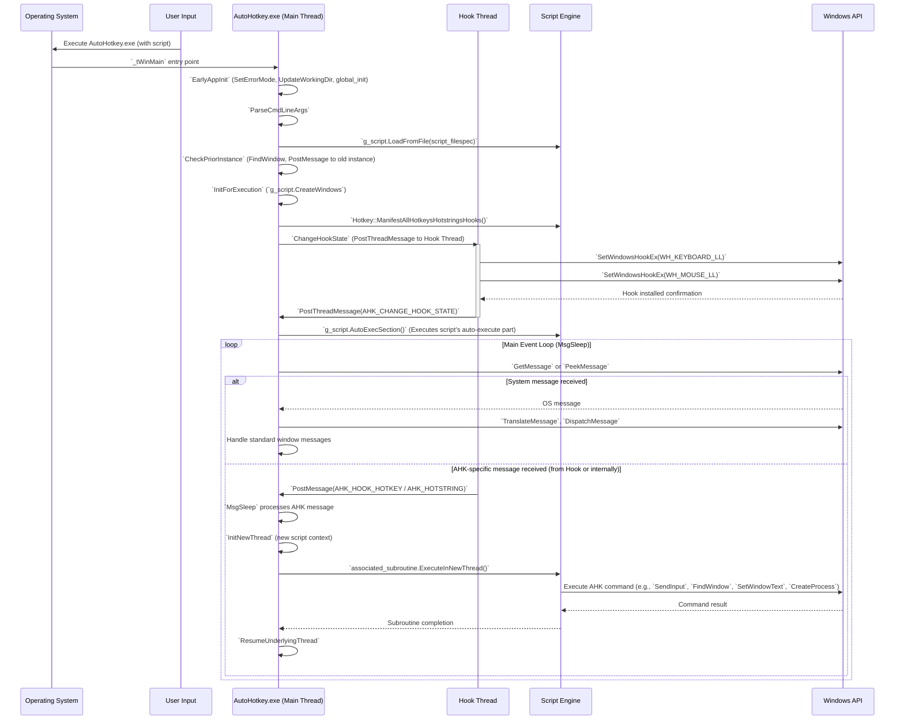

# AutoHotkey C++ Interpreter Design and Implementation Documentation

## 1) Executive Summary

### Synopsis

This repository contains the C++ source code for the AutoHotkey v2 interpreter. Its primary purpose is to parse, interpret, and execute AutoHotkey v2 scripts, translating high-level scripting commands into low-level Windows API (WinAPI) interactions. The program enables advanced desktop automation functionalities such as hotkeys, hotstrings, input simulation, GUI manipulation, and system process management by directly interfacing with the operating system through the Win32 API.

### High-Level Architecture Overview

The AutoHotkey C++ interpreter is structured around a multi-threaded, event-driven architecture designed for responsiveness and robust system control. Key components include:

*   **Main Application Thread**: Handles startup, command-line parsing, script loading, single-instance management, and orchestrates the primary event loop via `MsgSleep`, dispatching messages to various window procedures and managing script execution flow.
*   **Hook Thread**: A dedicated, high-priority thread that installs and manages low-level keyboard and mouse hooks. It intercepts input events, processes hotkeys and hotstrings, and communicates relevant events back to the main thread for script execution.
*   **Script Engine**: Parses AHK v2 script syntax, manages internal representations of hotkeys, hotstrings, GUI elements, variables, and functions. It's responsible for executing script commands, which in turn trigger WinAPI calls.
*   **WinAPI Integration Layer**: This pervasive layer directly calls a wide array of WinAPI functions for tasks such as input simulation (`SendInput`, `keybd_event`, `mouse_event`), window management (`FindWindow`, `SendMessage`, `CreateWindowEx`), process control (`CreateProcess`, `OpenProcess`), system hooks (`SetWindowsHookEx`), and GUI interactions.
*   **Global State Management**: A set of global and thread-local data structures maintain the application's state, including modifier key states, hotkey/hotstring definitions, and script execution context.
*   **Input & Hotstring Processors**: Modules within the hook thread and main thread that specifically handle the complex logic of matching keyboard/mouse input against defined hotkeys and hotstrings, including dead key handling, case sensitivity, and input level management.

These components collaborate to provide a seamless execution environment for AutoHotkey scripts, where script commands are translated into direct system actions through carefully managed WinAPI interactions.

### Explicit Statement

This document covers the C++ code only and does not include any AutoHotkey v2 scripts. The focus is on the C++ implementation details of the interpreter.

## 2) System Architecture

### Component & Module Map

The following table outlines the key C++ modules, their responsibilities, and significant WinAPI interactions within the AutoHotkey interpreter.

| Module/Path                 | Responsibility                               | Key Classes/Structs           | Key Functions                           | Key WinAPI Calls (Examples)       | Upstream Deps        | Downstream Deps                           |
| :-------------------------- | :------------------------------------------- | :---------------------------- | :-------------------------------------- | :-------------------------------- | :------------------- | :---------------------------------------- |
| `source/AutoHotkey.cpp`     | Application entry point, orchestrates startup, script loading, single-instance handling, and main execution loop. | `global_struct`, `Hotkey`, `Script`   | `_tWinMain`, `EarlyAppInit`, `ParseCmdLineArgs`, `CheckPriorInstance`, `InitForExecution`, `MainExecuteScript` | `SetErrorMode`, `FindResource`, `FindWindow`, `PostMessage`, `Sleep`, `MessageBox` | `globaldata.h`, `application.h`, `window.h`, `TextIO.h` | `application.cpp`, `window.cpp`, `globaldata.cpp`, `script.cpp`, `hotkey.cpp` |
| `source/application.h/.cpp` | Manages the main message pump, threading context switching (quasi-threads), script interruptibility, timers, and basic GUI interactions. | `MessageMode`, `CollectInputState`    | `MsgSleep`, `CheckScriptTimers`, `InitNewThread`, `ResumeUnderlyingThread`, `IsInterruptible`, `MsgBoxTimeout`, `InputTimeout`, `InitMenuPopup`, `UninitMenuPopup` | `GetMessage`, `PeekMessage`, `DispatchMessage`, `Sleep`, `SetTimer`, `KillTimer`, `MsgWaitForMultipleObjects`, `CreateThread`, `SetThreadPriority`, `GetMenuInfo`, `SetMenuInfo`, `SetWindowPos`, `GetForegroundWindow`, `GetWindowThreadProcessId`, `GetFocus`, `GetClassName`, `IsDialogMessage`, `TranslateAccelerator`, `SendMessage`, `SetWindowLong`, `GetWindowLong`, `ScreenToClient` | `stdafx.h`, `defines.h`, `globaldata.h`, `window.h`, `util.h`, `resource.h`, `script_gui.h` | `AutoHotkey.cpp`, `hook.cpp`, `window.cpp`, `script.cpp` |
| `source/hook.h/.cpp`        | Implements low-level keyboard and mouse hooks, hotkey/hotstring detection, input suppression/remapping, dead key handling, and Alt-Tab management. Runs in a dedicated high-priority thread. | `KBDLLHOOKSTRUCT`, `MSLLHOOKSTRUCT`, `key_type`, `hk_sorted_type`, `dead_key_record`, `HookType` | `LowLevelKeybdProc`, `LowLevelMouseProc`, `LowLevelCommon`, `IsIgnored`, `CollectInputState`, `EarlyCollectInput`, `CollectInput`, `CollectHotstring`, `CollectInputHook`, `KeyEvent`, `KeyEventMenuMask`, `IsHookActive`, `SetKeyHistoryMax`, `WaitHookIdle`, `ChangeHookState`, `AddRemoveHooks`, `FreeHookMem`, `ResetHook`, `UpdateKeybdState`, `KeybdEventIsPhysical` | `SetWindowsHookEx`, `UnhookWindowsHookEx`, `CallNextHookEx`, `CreateThread`, `SetThreadPriority`, `PostThreadMessage`, `CreateMutex`, `CloseHandle`, `GetTickCount`, `ToUnicodeEx` (implicitly via `ToUnicodeOrAsciiEx`), `GetKeyboardState`, `GetKeyState`, `GetAsyncKeyState`, `MapVirtualKey`, `FindWindow`, `GetWindowThreadProcessId`, `MsgBox` | `stdafx.h`, `globaldata.h`, `util.h`, `window.h`, `application.h` | `keyboard_mouse.cpp`, `hotkey.cpp`, `globaldata.cpp`, `script.cpp`, `application.cpp` |
| `source/keyboard_mouse.h/.cpp` | Provides utilities for keyboard/mouse state management, input synthesis, and related operations.                 | N/A | `GetKeyName`, `SimulateKey`, `KeyEvent`, `SendInput`, `BlockInput` | `SendInput`, `keybd_event`, `mouse_event`, `GetKeyState`, `GetAsyncKeyState`, `SetKeyState`, `MapVirtualKey`, `GetKeyboardLayout`, `ActivateKeyboardLayout`, `GetConversionStatus`, `GetKeyboardLayoutList`, `GetKeyboardLayoutName`, `ToAsciiEx`, `ToUnicodeEx`, `GetDoubleClickTime`, `GetCursorPos`, `SetCursorPos`, `ClipCursor`, `ShowCursor` | `stdafx.h`, `globaldata.h`, `util.h`    | `hook.cpp`, `script.cpp`, various input-related AHK commands                      |
| `source/window.h/.cpp`      | Encapsulates window manipulation functions, GUI control operations, and window-related utilities.                      | `GuiType`, `WinGroup`                 | `FindWindow`, `WinGetTitle`, `WinActivate`, `WinMinimize`, `WinMove`, `WinClose`, `GuiShow`, `GuiAdd`, `GetWindowText`, `SetWindowText`, `GetWindowRect`, `SetWindowPos`, `MoveWindow` | `FindWindow(Ex)`, `EnumWindows`, `GetWindowText`, `SetWindowText`, `GetWindowRect`, `SetWindowPos`, `MoveWindow`, `CreateWindowEx`, `DestroyWindow`, `ShowWindow`, `BringWindowToTop`, `SetForegroundWindow`, `SetActiveWindow`, `IsWindowVisible`, `IsWindowEnabled`, `EnableWindow`, `GetParent`, `SetParent`, `GetWindowThreadProcessId`, `MessageBox`, `FlashWindow` | `stdafx.h`, `globaldata.h`, `script.h` | `application.cpp`, `script_gui.cpp`       |
| `source/globaldata.h/.cpp`  | Manages global configuration, application-wide flags, shared state, and built-in variables.                        | `global_struct`, `Hotkey`, `ScriptTimer`, `UserMenu`, `MsgMonitorStruct` | `global_init`, `global_clear_state`     | N/A                                     | N/A                  | Almost all other modules                  |
| `source/script.h/.cpp`      | Core script parsing and execution engine; manages scripts, hotkeys, hotstrings, timers, and variables.              | `Script`, `ScriptTimer`, `Hotkey`, `Hotstring`, `Var` | `LoadFromFile`, `Init`, `AutoExecSection`, `ExitApp`, `CreateWindows`, `FindMenuItemByID`, `UpdateTrayIcon`, `DeleteTimer` | `FindResource`, `MessageBox` (via `CriticalError`) | `stdafx.h`, `globaldata.h`, `application.h`, `window.h`, `hotkey.h`, `hotstring.h`, `var.h`, `input_object.h` | `AutoHotkey.cpp`, `application.cpp`, `Hotkey.cpp`, `Input_Object.cpp`, `Script_GUI.cpp` |
| `source/hotkey.h/.cpp`      | Manages hotkey and hotstring definitions, criteria, and firing logic. Interfaces with the hook for input events. | `Hotkey`, `HotkeyVariant`, `Hotstring`, `HotkeyCriterion` | `ManifestAllHotkeysHotstringsHooks`, `CriterionAllowsFiring`, `PerformIsAllowed`, `RunAgainAfterFinished`, `PerformInNewThreadMadeByCaller`, `TriggerJoyHotkeys`, `FindHotkeyContainingModLR`, `FindPairedHotkey` | `PostMessage`, `GetKeyState`, `GetAsyncKeyState` (indirectly via `GetModifierLRState`) | `stdafx.h`, `globaldata.h`, `application.h`, `hook.h`, `keyboard_mouse.h` | `hook.cpp`, `script.cpp`, `input_object.cpp` |
| `source/TextIO.h/.cpp`      | Handles file I/O operations and string conversions.                                                              | `FILE`, `TCHAR`, `KuString`, `StringConv` | `OpenFile`, `CloseFile`, `ReadFile`, `WriteFile`, `ReadChar`, `WriteChar`, `CopyChar`, `fgettok`, `GetStringUTF8`, `StringAtoW`, `StringWtoA` | `CreateFile`, `ReadFile`, `WriteFile`, `CloseHandle`, `GetFileSize`, `SetFilePointer`, `MultiByteToWideChar`, `WideCharToMultiByte` | `stdafx.h`, `KuString.h`, `StringConv.h` | `AutoHotkey.cpp`, `script.cpp`, utility functions       |

### Layering Model

The AutoHotkey C++ interpreter can be conceptually divided into the following layers:

1.  **System Interaction / Infrastructure Layer**: This is the lowest layer, comprising direct WinAPI calls for fundamental system operations (e.g., memory, process, threads), low-level input hooks, and basic file I/O. Modules like `source/hook.cpp`, `source/keyboard_mouse.cpp`, and parts of `source/TextIO.cpp` primarily reside here.
2.  **Core Utilities Layer**: Provides foundational utilities and wrappers around basic system functionalities. This includes string manipulation (`KuString.h`, `StringConv.h`), generic helper functions (`source/util.h/.cpp`), and potentially some abstract WinAPI interactions used by higher layers. `source/globaldata.h/.cpp` also falls here by managing global application state.
3.  **Application / Event Management Layer**: Responsible for the main application lifecycle, message loop (`MsgSleep`), event dispatching, and managing thread-local contexts. This layer coordinates inputs from the hooks, system notifications, and external events, directing them to the appropriate script or internal handlers. `source/application.h/.cpp` (especially `MsgSleep` and threading logic) and `source/hotkey.h/.cpp` (for triggering hotkeys/hotstrings) are core to this layer.
4.  **Script Engine / Domain Logic Layer**: This is where AutoHotkey script semantics are implemented. It handles parsing script files, managing script objects (variables, functions, GUI controls), and executing script commands. The core logic of how AHK commands are translated into platform actions (often by calling down to the Application/Infrastructure layers) resides here. `source/script.h/.cpp` and all `script_*.cpp` files (e.g., `script_gui.cpp`, `script_object.cpp`) are central to this layer.
5.  **Presentation / GUI Layer**: Handles the creation and management of AutoHotkey's own GUI windows (e.g., script-created dialogs, tray icon menu). It interacts with the underlying WinAPI for window creation, message processing (via hooks in the Application layer), and control rendering. `source/window.h/.cpp` and `source/script_gui.cpp` implement this layer.

This layered approach helps in separating concerns, with higher layers abstracting the complexities of lower layers, promoting maintainability and modularity.

### Data Flow

The data flow within the AutoHotkey C++ interpreter can be conceptualized as an end-to-end pipeline, starting from input/configuration and culminating in AHK v2 script execution and system interaction.

1.  **Initialization & Configuration**:
    *   Command-line arguments (`_tWinMain`, `ParseCmdLineArgs` in `source/AutoHotkey.cpp`) provide initial configuration (e.g., script filespec, debug flags).
    *   `EarlyAppInit` sets critical error mode, updates working directories, and initializes global data structures (`global_init` in `source/globaldata.cpp`).
    *   Script-side configurations (e.g., `#SingleInstance`, `#MaxThreads`) are parsed by the `Script` object (`g_script.LoadFromFile`) and stored in global/script-specific data.

2.  **Input Acquisition (Hook Thread)**:
    *   The `HookThreadProc` (in `source/hook.cpp`), running in a high-priority thread, uses `SetWindowsHookEx(WH_KEYBOARD_LL)` and `SetWindowsHookEx(WH_MOUSE_LL)` to intercept raw keyboard and mouse events.
    *   `LowLevelKeybdProc` and `LowLevelMouseProc` analyze incoming `KBDLLHOOKSTRUCT` and `MSLLHOOKSTRUCT` data.
    *   Modifier states (Shift, Ctrl, Alt, Win) are meticulously tracked (`g_modifiersLR_logical`, `g_modifiersLR_physical` in `source/globaldata.cpp`).
    *   Joystick input is polled via `joyGetPosEx` in `PollJoysticks` (called from `MsgSleep`).
    *   Character translation (`ToUnicodeEx`) and dead key handling (`sPendingDeadKeys`) occur here for input events.

3.  **Hotkey/Hotstring Matching & Event Post**:
    *   The raw input events are matched against active hotkeys and hotstrings (defined by `Hotkey` and `Hotstring` objects) based on key combination, modifiers, and `#HotIf` criteria.
    *   If a match is found, the input might be suppressed (`SuppressThisKeyFunc`) or allowed to pass through (`AllowIt`).
    *   For matched hotkeys/hotstrings, a `AHK_HOOK_HOTKEY` or `AHK_HOTSTRING` message is `PostMessage`d to the main thread's message queue (`g_hWnd`). This decouples the high-speed hook processing from main thread execution.
    *   Other `input_type` events (e.g., InputHook `onKeyDown`, `onChar`, `onKeyUp`, `onEnd`) are also `PostMessage`d, if configured.

4.  **Main Thread Message Processing**:
    *   The `MsgSleep` function in the main thread's message loop (`for(;;)`) continuously retrieves messages using `GetMessage` or `PeekMessage`.
    *   `DispatchMessage` routes standard Windows messages to appropriate window procedures (e.g., `MainWindowProc`).
    *   Custom AutoHotkey messages (e.g., `AHK_HOOK_HOTKEY`, `AHK_GUI_ACTION`, `AHK_USER_MENU`, `AHK_CLIPBOARD_CHANGE`, `AHK_INPUT_END`) are handled within the `MsgSleep` switch-case block.

5.  **Script Execution & WinAPI Interaction**:
    *   Upon receiving an AHK-specific message, the main thread's `MsgSleep` might launch a new "quasi-thread" (a new `global_struct` context) by re-entering `MsgSleep` recursively or via `InitNewThread`. This allows concurrent (cooperative multitasking) script execution.
    *   The script engine (`g_script`) executes the associated hotkey/hotstring subroutine, timer, or GUI event handler.
    *   Script commands translate into direct WinAPI calls (e.g., `GuiAdd` calls `CreateWindowEx`, `Send "abc"` calls `SendInput`, `WinActivate` calls `SetForegroundWindow`, `SetActiveWindow`).
    *   The `KeyEvent`, `MouseClick`, `WinMove`, `ControlSend`, `DllCall`, and other command implementations directly invoke WinAPI functions.

6.  **Output & System Effects**:
    *   WinAPI calls initiated by script execution directly affect the operating system and user environment:
        *   Input simulation (keyboard, mouse).
        *   Window manipulation (move, resize, activate, hide).
        *   File system operations (`CreateFile`, `ReadFile`, `WriteFile`).
        *   Process management (`CreateProcess`).
        *   Registry operations.
        *   GUI updates (script-defined windows).
    *   Logging and diagnostics (e.g., `OutputDebugString`, custom logging facilities) record runtime information.

This intricate data flow ensures that AutoHotkey scripts can interact with the Windows environment at a deep technical level, providing powerful automation capabilities.

### Mermaid Diagrams

#### a) Component Diagram

```mermaid
graph TD
    subgraph "Main Application Process"
        A[AutoHotkey.exe - Main Thread] --> B(Command Line Parser);
        B --> C{Script Loader};
        C --> D[MsgSleep Loop (Event Dispatcher)];
        D --> E{Script Engine};
        E --> F[WinAPI Integration Layer];
        F --> G(GUI Manager);
        E -- Calls commands --> F;
        D -- Dispatches AHK Events --> E;
        D --> H(Global State);
        H --> E;
        H --> A;
        H --> C;
        D --> M[Input & Hotstring Processors (Main Thread)];
        M --> E;
    end

    subgraph "Hook Thread (High Priority)"
        I[Hook Thread Proc] --> J(Low-Level Keyboard Hook);
        I --> K(Low-Level Mouse Hook);
        J -- Intercepts Kb Events --> L{Input & Hotstring Processors (Hook Thread)};
        K -- Intercepts Mouse Events --> L;
        L --> D;
        L --> H;
        L -- Posts AHK Events, Updates State --> D;
        L --> N[Modifier State Tracking];
        N --> H;
    end

    subgraph "WinAPI / OS Services"
        F <--> O[System Services];
        F <--> P[Input Simulation (SendInput, keybd_event, mouse_event)];
        F <--> Q[Window Management (FindWindow, SendMessage, CreateWindowEx)];
        F <--> R[Process/Memory Management];
        F <--> S[Hooks (SetWindowsHookEx)];
        F <--> T[GUI Controls];
        F <--> U[Clipboard/Registry/File System];
        L -- Calls System API for context --> P;
        L -- Calls System API for context --> Q;
        L -- Calls System API for context --> S;
    end

    style A fill:#f9f,stroke:#333,stroke-width:2px;
    style D fill:#bbf,stroke:#333,stroke-width:2px;
    style E fill:#bfb,stroke:#333,stroke-width:2px;
    style I fill:#fcc,stroke:#333,stroke-width:2px;
    style L fill:#cbf,stroke:#333,stroke-width:2px;
    style F fill:#ffb,stroke:#333,stroke-width:2px;
```

#### b) Primary Sequence: "Start" to "AHK Generation" (Command Execution)



#### c) Data Model Relationships (Simplified for Hotkeys/Hotstrings)

```mermaid
classDiagram
    class Hotkey {
        +HotkeyIDType mID
        +mod_type mModifiers
        +modLR_type mModifiersLR
        +vk_type mVK
        +sc_type mSC
        +bool mKeyUp
        +HotkeyCriterion* mHotCriterion
        +int mPriority
        +list<HotkeyVariant> mVariants
        +HotkeyIDType mNextHotkey
