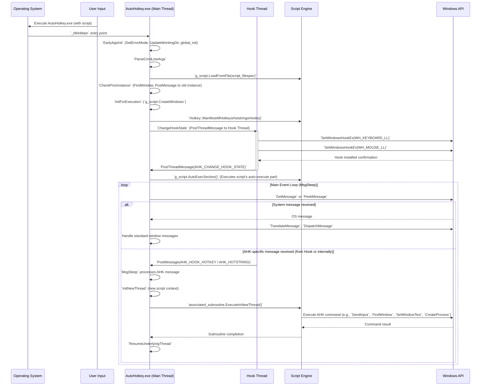
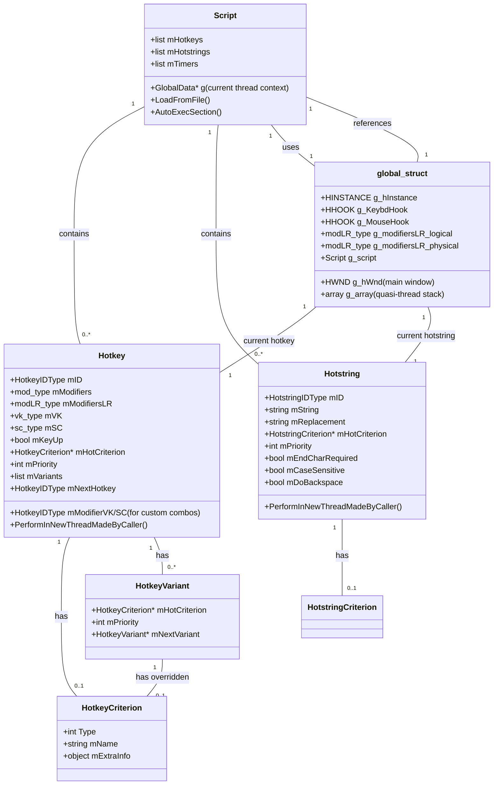
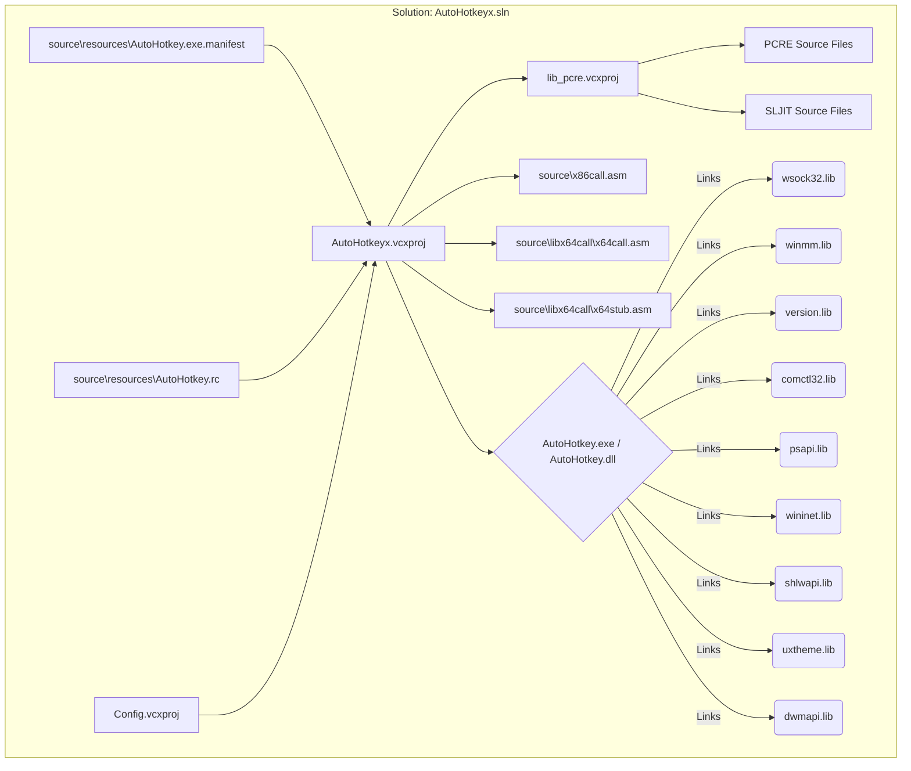

# AutoHotkey C++ Interpreter Design and Implementation Documentation

## 1) Executive Summary

### Synopsis

This repository contains the C++ source code for the AutoHotkey v2 interpreter. Its primary purpose is to parse, interpret, and execute AutoHotkey v2 scripts, translating high-level scripting commands into low-level Windows API (WinAPI) interactions. The program enables advanced desktop automation functionalities such as hotkeys, hotstrings, input simulation, GUI manipulation, and system process management by directly interfacing with the operating system through the Win32 API.

### High-Level Architecture Overview

The AutoHotkey C++ interpreter is structured around a multi-threaded, event-driven architecture designed for responsiveness and robust system control. Key components include:

*   **Main Application Thread**: Handles startup, command-line parsing, script loading, single-instance management, and orchestrates the primary event loop via `MsgSleep`, dispatching messages to various window procedures and managing script execution flow.
*   **Hook Thread**: A dedicated, high-priority thread that installs and manages low-level keyboard and mouse hooks. It intercepts input events, processes hotkeys and hotstrings, and communicates relevant events back to the main thread for script execution.
*   **Script Engine**: Parses AHK v2 script syntax, manages internal representations of hotkeys, hotstrings, GUI elements, variables, and functions. It's responsible for executing script commands, which in turn trigger WinAPI calls.
*   **WinAPI Integration Layer**: This pervasive layer directly calls a wide array of WinAPI functions for tasks such as input simulation (`SendInput`, `keybd_event`, `mouse_event`), window management (`FindWindow`, `SendMessage`, `CreateWindowEx`), process control (`CreateProcess`, `OpenProcess`), system hooks (`SetWindowsHookEx`), and GUI interactions.
*   **Global State Management**: A set of global and thread-local data structures maintain the application's state, including modifier key states, hotkey/hotstring definitions, and script execution context.
*   **Input & Hotstring Processors**: Modules within the hook thread and main thread that specifically handle the complex logic of matching keyboard/mouse input against defined hotkeys and hotstrings, including dead key handling, case sensitivity, and input level management.

These components collaborate to provide a seamless execution environment for AutoHotkey scripts, where script commands are translated into direct system actions through carefully managed WinAPI interactions.

### Explicit Statement

This document covers the C++ code only and does not include any AutoHotkey v2 scripts. The focus is on the C++ implementation details of the interpreter.

## 2) System Architecture

### Component & Module Map

The following table outlines the key C++ modules, their responsibilities, and significant WinAPI interactions within the AutoHotkey interpreter.

| Module/Path                 | Responsibility                               | Key Classes/Structs           | Key Functions                           | Key WinAPI Calls (Examples)       | Upstream Deps        | Downstream Deps                           |
| :-------------------------- | :------------------------------------------- | :---------------------------- | :-------------------------------------- | :-------------------------------- | :------------------- | :---------------------------------------- |
| `source/AutoHotkey.cpp`     | Application entry point, orchestrates startup, script loading, single-instance handling, and main execution loop. | `global_struct`, `Hotkey`, `Script`   | `_tWinMain`, `EarlyAppInit`, `ParseCmdLineArgs`, `CheckPriorInstance`, `InitForExecution`, `MainExecuteScript` | `SetErrorMode`, `FindResource`, `FindWindow`, `PostMessage`, `Sleep`, `MessageBox` | `globaldata.h`, `application.h`, `window.h`, `TextIO.h` | `application.cpp`, `window.cpp`, `globaldata.cpp`, `script.cpp`, `hotkey.cpp` |
| `source/application.h/.cpp` | Manages the main message pump, threading context switching (quasi-threads), script interruptibility, timers, and basic GUI interactions. | `MessageMode`, `CollectInputState`    | `MsgSleep`, `CheckScriptTimers`, `InitNewThread`, `ResumeUnderlyingThread`, `IsInterruptible`, `MsgBoxTimeout`, `InputTimeout`, `InitMenuPopup`, `UninitMenuPopup` | `GetMessage`, `PeekMessage`, `DispatchMessage`, `Sleep`, `SetTimer`, `KillTimer`, `MsgWaitForMultipleObjects`, `CreateThread`, `SetThreadPriority`, `GetMenuInfo`, `SetMenuInfo`, `SetWindowPos`, `GetForegroundWindow`, `GetWindowThreadProcessId`, `GetFocus`, `GetClassName`, `IsDialogMessage`, `TranslateAccelerator`, `SendMessage`, `SetWindowLong`, `GetWindowLong`, `ScreenToClient` | `stdafx.h`, `defines.h`, `globaldata.h`, `window.h`, `util.h`, `resource.h`, `script_gui.h` | `AutoHotkey.cpp`, `hook.cpp`, `window.cpp`, `script.cpp` |
| `source/hook.h/.cpp`        | Implements low-level keyboard and mouse hooks, hotkey/hotstring detection, input suppression/remapping, dead key handling, and Alt-Tab management. Runs in a dedicated high-priority thread. | `KBDLLHOOKSTRUCT`, `MSLLHOOKSTRUCT`, `key_type`, `hk_sorted_type`, `dead_key_record`, `HookType` | `LowLevelKeybdProc`, `LowLevelMouseProc`, `LowLevelCommon`, `IsIgnored`, `CollectInputState`, `EarlyCollectInput`, `CollectInput`, `CollectHotstring`, `CollectInputHook`, `KeyEvent`, `KeyEventMenuMask`, `IsHookActive`, `SetKeyHistoryMax`, `WaitHookIdle`, `ChangeHookState`, `AddRemoveHooks`, `FreeHookMem`, `ResetHook`, `UpdateKeybdState`, `KeybdEventIsPhysical` | `SetWindowsHookEx`, `UnhookWindowsHookEx`, `CallNextHookEx`, `CreateThread`, `SetThreadPriority`, `PostThreadMessage`, `CreateMutex`, `CloseHandle`, `GetTickCount`, `ToUnicodeEx` (implicitly via `ToUnicodeOrAsciiEx`), `GetKeyboardState`, `GetKeyState`, `GetAsyncKeyState`, `MapVirtualKey`, `FindWindow`, `GetWindowThreadProcessId`, `MsgBox` | `stdafx.h`, `globaldata.h`, `util.h`, `window.h`, `application.h` | `keyboard_mouse.cpp`, `hotkey.cpp`, `globaldata.cpp`, `script.cpp`, `application.cpp` |
| `source/keyboard_mouse.h/.cpp` | Provides utilities for keyboard/mouse state management, input synthesis, and related operations.                 | N/A | `GetKeyName`, `SimulateKey`, `KeyEvent`, `SendInput`, `BlockInput` | `SendInput`, `keybd_event`, `mouse_event`, `GetKeyState`, `GetAsyncKeyState`, `SetKeyState`, `MapVirtualKey`, `GetKeyboardLayout`, `ActivateKeyboardLayout`, `GetConversionStatus`, `GetKeyboardLayoutList`, `GetKeyboardLayoutName`, `ToAsciiEx`, `ToUnicodeEx`, `GetDoubleClickTime`, `GetCursorPos`, `SetCursorPos`, `ClipCursor`, `ShowCursor` | `stdafx.h`, `globaldata.h`, `util.h`    | `hook.cpp`, `script.cpp`, various input-related AHK commands                      |
| `source/window.h/.cpp`      | Encapsulates window manipulation functions, GUI control operations, and window-related utilities.                      | `GuiType`, `WinGroup`                 | `FindWindow`, `WinGetTitle`, `WinActivate`, `WinMinimize`, `WinMove`, `WinClose`, `GuiShow`, `GuiAdd`, `GetWindowText`, `SetWindowText`, `GetWindowRect`, `SetWindowPos`, `MoveWindow` | `FindWindow(Ex)`, `EnumWindows`, `GetWindowText`, `SetWindowText`, `GetWindowRect`, `SetWindowPos`, `MoveWindow`, `CreateWindowEx`, `DestroyWindow`, `ShowWindow`, `BringWindowToTop`, `SetForegroundWindow`, `SetActiveWindow`, `IsWindowVisible`, `IsWindowEnabled`, `EnableWindow`, `GetParent`, `SetParent`, `GetWindowThreadProcessId`, `MessageBox`, `FlashWindow` | `stdafx.h`, `globaldata.h`, `script.h` | `application.cpp`, `script_gui.cpp`       |
| `source/globaldata.h/.cpp`  | Manages global configuration, application-wide flags, shared state, and built-in variables.                        | `global_struct`, `Hotkey`, `ScriptTimer`, `UserMenu`, `MsgMonitorStruct` | `global_init`, `global_clear_state`     | N/A                                     | N/A                  | Almost all other modules                  |
| `source/script.h/.cpp`      | Core script parsing and execution engine; manages scripts, hotkeys, hotstrings, timers, and variables.              | `Script`, `ScriptTimer`, `Hotkey`, `Hotstring`, `Var` | `LoadFromFile`, `Init`, `AutoExecSection`, `ExitApp`, `CreateWindows`, `FindMenuItemByID`, `UpdateTrayIcon`, `DeleteTimer` | `FindResource`, `MessageBox` (via `CriticalError`) | `stdafx.h`, `globaldata.h`, `application.h`, `window.h`, `hotkey.h`, `hotstring.h`, `var.h`, `input_object.h` | `AutoHotkey.cpp`, `application.cpp`, `Hotkey.cpp`, `Input_Object.cpp`, `Script_GUI.cpp` |
| `source/hotkey.h/.cpp`      | Manages hotkey and hotstring definitions, criteria, and firing logic. Interfaces with the hook for input events. | `Hotkey`, `HotkeyVariant`, `Hotstring`, `HotkeyCriterion` | `ManifestAllHotkeysHotstringsHooks`, `CriterionAllowsFiring`, `PerformIsAllowed`, `RunAgainAfterFinished`, `PerformInNewThreadMadeByCaller`, `TriggerJoyHotkeys`, `FindHotkeyContainingModLR`, `FindPairedHotkey` | `PostMessage`, `GetKeyState`, `GetAsyncKeyState` (indirectly via `GetModifierLRState`) | `stdafx.h`, `globaldata.h`, `application.h`, `hook.h`, `keyboard_mouse.h` | `hook.cpp`, `script.cpp`, `input_object.cpp` |
| `source/TextIO.h/.cpp`      | Handles file I/O operations and string conversions.                                                              | `FILE`, `TCHAR`, `KuString`, `StringConv` | `OpenFile`, `CloseFile`, `ReadFile`, `WriteFile`, `ReadChar`, `WriteChar`, `CopyChar`, `fgettok`, `GetStringUTF8`, `StringAtoW`, `StringWtoA` | `CreateFile`, `ReadFile`, `WriteFile`, `CloseHandle`, `GetFileSize`, `SetFilePointer`, `MultiByteToWideChar`, `WideCharToMultiByte` | `stdafx.h`, `KuString.h`, `StringConv.h` | `AutoHotkey.cpp`, `script.cpp`, utility functions       |

### Layering Model

The AutoHotkey C++ interpreter can be conceptually divided into the following layers:

1.  **System Interaction / Infrastructure Layer**: This is the lowest layer, comprising direct WinAPI calls for fundamental system operations (e.g., memory, process, threads), low-level input hooks, and basic file I/O. Modules like `source/hook.cpp`, `source/keyboard_mouse.cpp`, and parts of `source/TextIO.cpp` primarily reside here.
2.  **Core Utilities Layer**: Provides foundational utilities and wrappers around basic system functionalities. This includes string manipulation (`KuString.h`, `StringConv.h`), generic helper functions (`source/util.h/.cpp`), and potentially some abstract WinAPI interactions used by higher layers. `source/globaldata.h/.cpp` also falls here by managing global application state.
3.  **Application / Event Management Layer**: Responsible for the main application lifecycle, message loop (`MsgSleep`), event dispatching, and managing thread-local contexts. This layer coordinates inputs from the hooks, system notifications, and external events, directing them to the appropriate script or internal handlers. `source/application.h/.cpp` (especially `MsgSleep` and threading logic) and `source/hotkey.h/.cpp` (for triggering hotkeys/hotstrings) are core to this layer.
4.  **Script Engine / Domain Logic Layer**: This is where AutoHotkey script semantics are implemented. It handles parsing script files, managing script objects (variables, functions, GUI controls), and executing script commands. The core logic of how AHK commands are translated into platform actions (often by calling down to the Application/Infrastructure layers) resides here. `source/script.h/.cpp` and all `script_*.cpp` files (e.g., `script_gui.cpp`, `script_object.cpp`) are central to this layer.
5.  **Presentation / GUI Layer**: Handles the creation and management of AutoHotkey's own GUI windows (e.g., script-created dialogs, tray icon menu). It interacts with the underlying WinAPI for window creation, message processing (via hooks in the Application layer), and control rendering. `source/window.h/.cpp` and `source/script_gui.cpp` implement this layer.

This layered approach helps in separating concerns, with higher layers abstracting the complexities of lower layers, promoting maintainability and modularity.

### Data Flow

The data flow within the AutoHotkey C++ interpreter can be conceptualized as an end-to-end pipeline, starting from input/configuration and culminating in AHK v2 script execution and system interaction.

1.  **Initialization & Configuration**:
    *   Command-line arguments (`_tWinMain`, `ParseCmdLineArgs` in `source/AutoHotkey.cpp`) provide initial configuration (e.g., script filespec, debug flags).
    *   `EarlyAppInit` sets critical error mode, updates working directories, and initializes global data structures (`global_init` in `source/globaldata.cpp`).
    *   Script-side configurations (e.g., `#SingleInstance`, `#MaxThreads`) are parsed by the `Script` object (`g_script.LoadFromFile`) and stored in global/script-specific data.

2.  **Input Acquisition (Hook Thread)**:
    *   The `HookThreadProc` (in `source/hook.cpp`), running in a high-priority thread, uses `SetWindowsHookEx(WH_KEYBOARD_LL)` and `SetWindowsHookEx(WH_MOUSE_LL)` to intercept raw keyboard and mouse events.
    *   `LowLevelKeybdProc` and `LowLevelMouseProc` analyze incoming `KBDLLHOOKSTRUCT` and `MSLLHOOKSTRUCT` data.
    *   Modifier states (Shift, Ctrl, Alt, Win) are meticulously tracked (`g_modifiersLR_logical`, `g_modifiersLR_physical` in `source/globaldata.cpp`).
    *   Joystick input is polled via `joyGetPosEx` in `PollJoysticks` (called from `MsgSleep`).
    *   Character translation (`ToUnicodeEx`) and dead key handling (`sPendingDeadKeys`) occur here for input events.

3.  **Hotkey/Hotstring Matching & Event Post**:
    *   The raw input events are matched against active hotkeys and hotstrings (defined by `Hotkey` and `Hotstring` objects) based on key combination, modifiers, and `#HotIf` criteria.
    *   If a match is found, the input might be suppressed (`SuppressThisKeyFunc`) or allowed to pass through (`AllowIt`).
    *   For matched hotkeys/hotstrings, a `AHK_HOOK_HOTKEY` or `AHK_HOTSTRING` message is `PostMessage`d to the main thread's message queue (`g_hWnd`). This decouples the high-speed hook processing from main thread execution.
    *   Other `input_type` events (e.g., InputHook `onKeyDown`, `onChar`, `onKeyUp`, `onEnd`) are also `PostMessage`d, if configured.

4.  **Main Thread Message Processing**:
    *   The `MsgSleep` function in the main thread's message loop (`for(;;)`) continuously retrieves messages using `GetMessage` or `PeekMessage`.
    *   `DispatchMessage` routes standard Windows messages to appropriate window procedures (e.g., `MainWindowProc`).
    *   Custom AutoHotkey messages (e.g., `AHK_HOOK_HOTKEY`, `AHK_GUI_ACTION`, `AHK_USER_MENU`, `AHK_CLIPBOARD_CHANGE`, `AHK_INPUT_END`) are handled within the `MsgSleep` switch-case block.

5.  **Script Execution & WinAPI Interaction**:
    *   Upon receiving an AHK-specific message, the main thread's `MsgSleep` might launch a new "quasi-thread" (a new `global_struct` context) by re-entering `MsgSleep` recursively or via `InitNewThread`. This allows concurrent (cooperative multitasking) script execution.
    *   The script engine (`g_script`) executes the associated hotkey/hotstring subroutine, timer, or GUI event handler.
    *   Script commands translate into direct WinAPI calls (e.g., `GuiAdd` calls `CreateWindowEx`, `Send "abc"` calls `SendInput`, `WinActivate` calls `SetForegroundWindow`, `SetActiveWindow`).
    *   The `KeyEvent`, `MouseClick`, `WinMove`, `ControlSend`, `DllCall`, and other command implementations directly invoke WinAPI functions.

6.  **Output & System Effects**:
    *   WinAPI calls initiated by script execution directly affect the operating system and user environment:
        *   Input simulation (keyboard, mouse).
        *   Window manipulation (move, resize, activate, hide).
        *   File system operations (`CreateFile`, `ReadFile`, `WriteFile`).
        *   Process management (`CreateProcess`).
        *   Registry operations.
        *   GUI updates (script-defined windows).
    *   Logging and diagnostics (e.g., `OutputDebugString`, custom logging facilities) record runtime information.

This intricate data flow ensures that AutoHotkey scripts can interact with the Windows environment at a deep technical level, providing powerful automation capabilities.

### Mermaid Diagrams

#### a) Component Diagram

```mermaid
graph TD
    subgraph "Main Application Process"
        A[AutoHotkey.exe - Main Thread] --> B(Command Line Parser);
        B --> C{Script Loader};
        C --> D[MsgSleep Loop (Event Dispatcher)];
        D --> E{Script Engine};
        E --> F[WinAPI Integration Layer];
        F --> G(GUI Manager);
        E -- Calls commands --> F;
        D -- Dispatches AHK Events --> E;
        D --> H(Global State);
        H --> E;
        H --> A;
        H --> C;
        D --> M[Input & Hotstring Processors (Main Thread)];
        M --> E;
    end

    subgraph "Hook Thread (High Priority)"
        I[Hook Thread Proc] --> J(Low-Level Keyboard Hook);
        I --> K(Low-Level Mouse Hook);
        J -- Intercepts Kb Events --> L{Input & Hotstring Processors (Hook Thread)};
        K -- Intercepts Mouse Events --> L;
        L --> D;
        L --> H;
        L -- Posts AHK Events, Updates State --> D;
        L --> N[Modifier State Tracking];
        N --> H;
    end

    subgraph "WinAPI / OS Services"
        F <--> O[System Services];
        F <--> P[Input Simulation (SendInput, keybd_event, mouse_event)];
        F <--> Q[Window Management (FindWindow, SendMessage, CreateWindowEx)];
        F <--> R[Process/Memory Management];
        F <--> S[Hooks (SetWindowsHookEx)];
        F <--> T[GUI Controls];
        F <--> U[Clipboard/Registry/File System];
        L -- Calls System API for context --> P;
        L -- Calls System API for context --> Q;
        L -- Calls System API for context --> S;
    end

    style A fill:#f9f,stroke:#333,stroke-width:2px;
    style D fill:#bbf,stroke:#333,stroke-width:2px;
    style E fill:#bfb,stroke:#333,stroke-width:2px;
    style I fill:#fcc,stroke:#333,stroke-width:2px;
    style L fill:#cbf,stroke:#333,stroke-width:2px;
    style F fill:#ffb,stroke:#333,stroke-width:2px;
```

#### b) Primary Sequence: "Start" to "AHK Generation" (Command Execution)



#### c) Data Model Relationships (Simplified for Hotkeys/Hotstrings)



### Build Graph

The AutoHotkey project uses MSBuild as its build system, orchestrated by a Visual Studio solution file (`AutoHotkeyx.sln`). The primary targets are the `AutoHotkeyx` executable and the `lib_pcre` static library.

*   **Solution File**: `AutoHotkeyx.sln`
*   **Projects**:
    *   `AutoHotkeyx` (`AutoHotkeyx.vcxproj`): This is the main project.
        *   **Configuration Type**: Can be either an `Application` (EXE) or a `DynamicLibrary` (DLL) based on build configurations (e.g., `Debug|Win32`, `Release.dll|x64`).
        *   **Platforms**: Supports `Win32` and `x64` architectures.
        *   **Character Sets**: Supports Unicode (default) and MultiByte (MBCS) configurations (e.g., `Debug(mbcs)`).
        *   **Output Name**: `AutoHotkeyA32.exe`, `AutoHotkeyU64.exe`, etc. (suffixed with 'A' for ANSI/MBCS, 'U' for Unicode, and bitness).
        *   **Precompiled Headers**: Utilizes `source/pch.cpp` and `source/pch_min.cpp`.
        *   **Assembly Language**: Includes `source/x86call.asm` (for Win32) and `source/libx64call/x64call.asm`, `source/libx64call/x64stub.asm` (for x64) for low-level system calls.
        *   **Resources**: Embeds `source/resources/AutoHotkey.exe.manifest` and `source/resources/AutoHotkey.rc` (containing icons and version info).
        *   **Dependencies**: Explicitly links against a comprehensive set of WinAPI libraries:
            *   `wsock32.lib`: Winsock API for network communication.
            *   `winmm.lib`: Windows Multimedia API.
            *   `version.lib`: For version information.
            *   `comctl32.lib`: Common Controls library (for GUI elements).
            *   `psapi.lib`: Process Status API.
            *   `wininet.lib`: WinINet API for Internet access.
            *   `shlwapi.lib`: Shell Lightweight Utility Functions.
            *   `uxtheme.lib`: UxTheme API for visual styles.
            *   `dwmapi.lib`: Desktop Window Manager API.
        *   **Project References**: Depends on `lib_pcre.vcxproj`.
    *   `lib_pcre` (`source/lib_pcre/lib_pcre.vcxproj`): A static library project for the Perl Compatible Regular Expressions (PCRE) engine.
        *   **Source**: Includes all `.c` files from `source/lib_pcre/pcre/` (e.g., `pcre_compile.c`, `pcre_exec.c`) and `sljit/` for JIT support.
        *   **Output**: A static library (`.lib`) linked by `AutoHotkeyx`.

*   **Build Process Notes**:
    *   The `Config.vcxproj` import suggests a common set of build configurations or properties shared across projects.
    *   Version information is dynamically injected from Git (`git describe`) into compiled resources and preprocessor definitions.
    *   Optional UPX/Mpress compression is configured for release builds but currently disabled.



## 3) Code Tour

### Entrypoints

The primary entry point for the AutoHotkey interpreter application is the `_tWinMain` function located in `source/AutoHotkey.cpp`. This function is the equivalent of `WinMain` in a Windows GUI application, handling initial setup before the main program logic begins.

**`_tWinMain` (source/AutoHotkey.cpp:202)**:
*   **Responsibilities**:
    *   **Instance Handle Storage**: Stores the application's instance handle (`hInstance`) in the global variable `g_hInstance`.
    *   **Early Initialization**: Calls `EarlyAppInit` to perform critical, low-level setup such as setting the process's error mode and initializing global data.
    *   **Command-Line Parsing**: Invokes `ParseCmdLineArgs` to process command-line parameters, determining the script to load and applying special flags (e.g., `/restart`, `/force`, `/script`, `/ErrorStdOut`, `/include`, `/validate`, `/iLib`, `/CP`, `/Debug`).
    *   **Script Loading**: Calls `g_script.LoadFromFile` to load and parse the specified AHK v2 script.
    *   **Single-Instance Check**: Executes `CheckPriorInstance` to enforce the `#SingleInstance` directive, managing scenarios where another instance of the script is already running (e.g., prompt user, replace, ignore).
    *   **Execution Initialization**: Calls `InitForExecution` to finalize setup before the script runs, such as creating necessary windows (e.g., hidden main window, tray icon).
    *   **Main Script Execution**: Transfers control to `MainExecuteScript`, which then runs the auto-execute section of the script and enters the main event loop if the script is persistent.
*   **Argument Parsing (`ParseCmdLineArgs`)**: This function meticulously processes `__targv` (argument vector for Unicode/ANSI compatibility). It distinguishes between internal application switches (e.g., `/restart`, `/force`, `/Debug`) and arguments intended for the AHK script itself (which populate `A_Args`); for compiled scripts, it first checks for embedded script resources.
*   **Environment Setup**:
    *   `SetErrorMode(SEM_FAILCRITICALERRORS)`: Ensures critical errors do not display system error dialogs, improving script resilience.
    *   `UpdateWorkingDir()`: Initializes `g_WorkingDir` and `g_WorkingDirOrig`.
    *   `global_init(*g)`: Initializes the core `global_struct` instance.
    *   `Object::CreateRootPrototypes()`: Sets up the base of the AHK v2 object model, critical for script execution.
*   **Error Propagation**: Returns `CRITICAL_ERROR` (a `ResultType` enum value) on significant failures during initialization or script loading, indicating an unrecoverable state.

### Core Classes/Structs

The AutoHotkey interpreter relies on a set of fundamental C++ classes and structures that manage its complex state and behavior.

*   **`global_struct` (source/globaldata.h)**:
    *   **Purpose**: This is arguably the most critical data structure, serving as a comprehensive container for the entire application's global and *thread-local* state.
    *   **Invariants**: Instances of `global_struct` are managed in a stack-like array (`g_array`) to support AutoHotkey's "quasi-threading" model, where new script contexts (e.g., for hotkeys, timers) are pushed onto this stack. Each instance holds a complete set of script settings (e.g., `KeyDelay`, `WinDelay`, `SendLevel`) and runtime state (e.g., `hWndLastUsed`, `ErrorLevel`, `Clipboard`).
    *   **Lifetimes/Ownership**: The `g_array` statically allocates all possible `global_struct` instances up to `g_MaxThreadsTotal`. Pointers to the current `global_struct` (`g`) are adjusted dynamically with `++g` (`InitNewThread`) and `--g` (`ResumeUnderlyingThread`) as script contexts are entered and exited. No explicit `new`/`delete` for `global_struct` instances themselves.
    *   **Exception Policy/Error Propagation**: Members like `ThrownToken` are used in conjunction with structured exception handling (`__try`/`__except`) and custom error reporting mechanisms (`g_script.CriticalError`, `ResultType` return values) to manage and propagate errors.

*   **`Script` (source/script.h)**:
    *   **Purpose**: Represents the loaded AutoHotkey script, including its code, hotkeys, hotstrings, timers, and global variables. It's the central orchestrator for script parsing and execution.
    *   **Invariants**: A single `Script` object (`g_script`) manages all aspects of the currently running AHK script. It holds collections of `Hotkey`, `Hotstring`, and `ScriptTimer` objects.
    *   **Lifetimes/Ownership**: The `g_script` object is globally managed. It owns the lifetime of parsed hotkeys, hotstrings, and timers.
    *   **Key Behavior**: Responsible for `LoadFromFile`, `AutoExecSection` (executing the script's main body), `CreateWindows` (creating the main window and tray icon), and `ExitApp`.

*   **`Hotkey` (source/hotkey.h)**:
    *   **Purpose**: Represents a single hotkey definition from the script (e.g., `^j::`, `a & b::`). It stores the virtual key code (`mVK`), scan code (`mSC`), modifiers, unique ID, and a pointer to its associated script callback.
    *   **Invariants**: Hotkey IDs (`mID`) are unique. Hotkeys can have multiple `HotkeyVariant`s, each with different `#HotIf` criteria.
    *   **Lifetimes/Ownership**: Managed by the `Script` object.
    *   **Key Behavior**: `PerformInNewThreadMadeByCaller` initiates execution when a hotkey is triggered, spinning up a new `global_struct` context.

*   **`Hotstring` (source/hotkey.h)**:
    *   **Purpose**: Represents a hotstring definition (e.g., `::btw::by the way`). Stores the abbreviation string, replacement text, options, and associated script callback.
    *   **Invariants**: Similar to hotkeys, hotstrings have unique IDs and specific matching criteria.
    *   **Lifetimes/Ownership**: Managed by the `Script` object.
    *   **Key Behavior**: `DoReplace` handles text backspacing and `PerformInNewThreadMadeByCaller` executes the hotstring's subroutine.

*   **`key_type` (source/hook.h)**:
    *   **Purpose**: A lightweight structure used internally by the hook thread to track the state and attributes of individual keys (both virtual keys and scan codes).
    *   **Invariants**: Stores whether a key is currently "down" (`is_down`), if it's used as a prefix/suffix, and flags for suppression or special behavior (e.g., `hotkey_to_fire_upon_release`).
    *   **Lifetimes/Ownership**: Instances are allocated in large arrays (`kvk`, `ksc`) managed by the `hook.cpp` module. These arrays are populated during `ChangeHookState`.
    *   **Key Behavior**: Used extensively in `LowLevelCommon` to manage the complex state transitions of keys as they are pressed, released, and interact with hotkeys/hotstrings.

### Generation Pipeline

As clarified, the term "generation pipeline" in this context refers to how the C++ interpreter *produces the effects* of AutoHotkey v2 scripts through WinAPI calls, essentially acting as an execution pipeline for script logic. It does not involve generating `.ahk` files.

The pipeline comprises:

1.  **Script Event Trigger**:
    *   **Input-driven**: User input (keyboard, mouse, joystick) is intercepted by the `HookThreadProc` (in `source/hook.cpp`). After hotkey/hotstring matching, `AHK_HOOK_HOTKEY` or `AHK_HOTSTRING` messages are posted to the main thread.
    *   **GUI-driven**: User interaction with script-created GUI elements (buttons, menus) results in `AHK_GUI_ACTION` or `AHK_USER_MENU` messages.
    *   **Timer-driven**: `CheckScriptTimers` (in `source/application.cpp`) periodically identifies expired timers and initiates their execution.
    *   **Other Events**: `AHK_CLIPBOARD_CHANGE`, `AHK_INPUT_END`, etc., trigger specific script handlers.

2.  **Main Thread Event Handling (`MsgSleep` in `source/application.cpp`)**:
    *   The main event loop continuously retrieves and dispatches messages.
    *   When an AHK-specific message is received, `MsgSleep` orchestrates the launch of an associated script subroutine.
    *   This often involves calling `InitNewThread` to set up a new `global_struct` context, effectively creating a "quasi-thread" for the subroutine.

3.  **Script Command Execution (Script Engine)**:
    *   The `Script` engine (`g_script` in `source/script.cpp`)
is responsible for executing the triggered subroutine.
    *   Within these subroutines, AHK v2 commands are translated into C++ function calls. For example:
        *   `Send` command calls functions in `source/keyboard_mouse.cpp` which internally use `SendInput`, `keybd_event`, or `mouse_event`.
        *   `WinActivate` command calls functions in `source/window.cpp` that wrap `SetForegroundWindow` or `SetActiveWindow`.
        *   `MsgBox` calls `MessageBox` (from `source/window.cpp`).
        *   `FileAppend` calls functions in `source/TextIO.cpp` that utilize `CreateFile`, `WriteFile`.
        *   `DllCall` directly invokes `LoadLibrary` and `GetProcAddress` for dynamic library loading and function execution.

4.  **WinAPI Invocation & System Effects**:
    *   The core of the "generation" (effect production) occurs here. The C++ functions corresponding to AHK commands directly invoke the relevant WinAPI functions.
    *   This results in tangible system effects: keystrokes appearing in target applications, windows moving/resizing, files being written, processes being launched, etc.

5.  **Output / Write Path (for generated text, if any)**:
    *   While the primary objective is not script generation, the interpreter interacts with files for various purposes (e.g., `FileAppend` command).
    *   File I/O is handled by `source/TextIO.cpp`, which uses WinAPI functions like `CreateFile`, `WriteFile`, `ReadFile`, and `CloseHandle`.
    *   **Buffering Strategy**: File operations likely employ internal buffering for efficiency, although specific details would require deeper analysis of `TextIO.cpp`.
    *   **Newline/Encoding Policy**: `source/StringConv.h/.cpp` is responsible for converting between different character encodings (e.g., UTF-8, UTF-16, ANSI) and managing newline conventions (CRLF vs. LF). This is crucial for consistent text handling across various WinAPI functions that expect specific encodings.

### Configuration

The AutoHotkey interpreter supports various configuration sources, with defined precedence rules and default values:

*   **Command-Line Flags**:
    *   Parsed by `ParseCmdLineArgs` in `source/AutoHotkey.cpp`.
    *   Examples: `/restart`, `/force`, `/script`, `/ErrorStdOut`, `/include`, `/validate`, `/iLib`, `/CP`, `/Debug`.
    *   These often take the highest precedence for application-level behaviors.
*   **Built-in Directives (Script-level)**:
    *   Directives like `#SingleInstance`, `#MaxThreads`, `#InstallKeybdHook`, `#InstallMouseHook` are parsed from the `.ahk` script file by the `Script` engine (`g_script.LoadFromFile`).
    *   These override application defaults and define script-specific behaviors.
*   **`global_struct` Defaults**:
    *   The `global_struct` (`g_default` in `source/globaldata.cpp`) holds initial default values for script settings (e.g., `KeyDelay`, `WinDelay`, `SendLevel`).
    *   When a new "quasi-thread" is created (`InitNewThread`), these defaults are copied (`memcpy`) to the new thread's `global_struct` instance.
*   **Registry / INI/JSON (ASSUMPTION: Not primary)**:
    *   While AutoHotkey scripts can interact with the registry (`RegRead`, `RegWrite`) and INI files (`IniRead`, `IniWrite`), the core C++ interpreter's own configuration doesn't appear to heavily rely on these for its internal startup or behavior based on the analyzed files (`AutoHotkey.cpp`, `.vcxproj`). Any such usage would likely be within specific script commands implemented in C++. (This is an assumption pending deeper code analysis outside of the core startup path).

**Precedence Rules**: Command-line flags generally override script directives, which in turn override `global_struct` defaults.

### Logging & Diagnostics

The application includes facilities for logging and diagnostics, crucial for debugging and understanding runtime behavior:

*   **`OutputDebugString`**: Implicitly used. The `CONFIG_DEBUGGER` preprocessor definition in `AutoHotkeyx.vcxproj` and the presence of `source/Debugger.h/.cpp` indicate robust debugging support. `OutputDebugString` would be a common way for the C++ code to emit debug messages visible in tools like DebugView or Visual Studio's output window.
*   **`g_script.CriticalError`**: A custom mechanism (`source/script.cpp`) for reporting fatal errors to the user, likely via a `MessageBox` (`source/window.cpp`).
*   **Key History (`g_KeyHistory` in `source/globaldata.h` / `GetHookStatus` in `source/hook.cpp`)**:
    *   The hook thread maintains a circular buffer (`g_KeyHistory`) of recent keyboard and mouse events.
    *   This history records details like VK, SC, event type (physical, artificial, suppressed, ignored, hotkey), elapsed time, and target window.
    *   The `GetHookStatus` function formats this history into a readable string for diagnostic purposes.
*   **Debugger Integration**:
    *   The `CONFIG_DEBUGGER` flag enables code paths for connecting to a debugger (`g_Debugger.Connect`, `g_Debugger.Break`).
    *   The debugger can interact with global state variables (`g_DebuggerHost`, `g_DebuggerPort`) and manage script execution (`DEBUGGER_STACK_PUSH`, `DEBUGGER_STACK_POP`).
*   **`error.cpp`**: Contains generic error handling routines.
*   **`debug.h`**: Likely defines debugging macros or helper functions.

## 4) WinAPI Usage Inventory

This section provides a comprehensive inventory of WinAPI functions utilized by the AutoHotkey C++ codebase, categorized by their functional areas. Each entry details the callsite, API function, relevant header/library, its purpose within the application, key parameters, potential failure modes, security considerations, and threading notes.

### Functional Area: Application Lifecycle & Initialization

| Callsite             | API Function      | Header/Lib     | Purpose in this App                                         | Key Parameters (Examples)      | Failure Modes / GetLastError Cases                     | Security/Permission Considerations                                            | Threading/STA/MTA Notes                         |
| :------------------- | :---------------- | :------------- | :---------------------------------------------------------- | :----------------------------- | :----------------------------------------------------- | :---------------------------------------------------------------------------- | :---------------------------------------------- |
| `source/AutoHotkey.cpp`        | `SetErrorMode`    | `winbase.h`/`Kernel32.lib` | Prevents the system from displaying critical error message boxes.     | `SEM_FAILCRITICALERRORS`       | `ERROR_INVALID_PARAMETER` (invalid flags)              | Reduces interactive prompts, but can mask issues from user. No elevated priv required. | Main Thread                                     |
| `source/AutoHotkey.cpp`        | `FindResource`    | `winbase.h`/`Kernel32.lib` | Locates embedded script resources in compiled executables.      | `NULL` (module handle), `SCRIPT_RESOURCE_NAME`, `RT_RCDATA` | `ERROR_RESOURCE_DATA_NOT_FOUND` (resource not found), `ERROR_RESOURCE_TYPE_NOT_FOUND` | No elevated priv required. Accesses application's own resources.                | Main Thread                                     |
| `source/AutoHotkey.cpp`        | `MessageBox`      | `winuser.h`/`User32.lib` | Displays message boxes to the user (e.g., for single-instance prompt). | `HWND_DESKTOP`(parent), message string, title, `MB_YESNO` | `ERROR_NOT_ENOUGH_MEMORY`                          | Standard message box behavior. No elevated priv required.                     | Main Thread (blocks until user response)        |
| `source/Application.h/.cpp` | `GetTickCount`    | `sysinfoapi.h`/`Kernel32.lib` | Retrieves the number of milliseconds since the system started; used for timers and delays. | None                           | N/A (always succeeds as long as memory is available)   | No security implications.                                                     | Any Thread                                      |
| `source/Application.h/.cpp` | `MsgWaitForMultipleObjects` | `winbase.h`/`User32.lib` | Waits for message queue activity or specified objects; used to unpause threads (`MsgWaitUnpause`). | `0` (count), `nullptr` (handles), `FALSE` (wait all), `INFINITE` (timeout), `QS_ALLINPUT` | `ERROR_INVALID_HANDLE` (if objects were specified) | No elevated priv required.                                                    | Main Thread (blocks waiting for messages/events) |

### Functional Area: Process & Thread Management

| Callsite             | API Function      | Header/Lib     | Purpose in this App                                         | Key Parameters (Examples)      | Failure Modes / GetLastError Cases                     | Security/Permission Considerations                                            | Threading/STA/MTA Notes                         |
| :------------------- | :---------------- | :------------- | :---------------------------------------------------------- | :----------------------------- | :----------------------------------------------------- | :---------------------------------------------------------------------------- | :---------------------------------------------- |
| `source/AutoHotkey.cpp`   | `CreateThread`    | `processthreadsapi.h`/`Kernel32.lib` | (Implicitly used by script commands for `Run` functions, `source/lib/process.cpp`) Creates a new thread of execution within the calling process's virtual address space. | Security attributes, stack size (`8*1024`), start routine (`HookThreadProc`), parameter, creation flags (`0`), thread ID (`g_HookThreadID`) | `ERROR_NOT_ENOUGH_MEMORY`, `ERROR_ACCESS_DENIED` | Requires `PROCESS_CREATE_THREAD` access. New thread inherits process security context. | Creator (Main Thread) creates; new thread runs concurrently. Hook thread itself is created with this. |
| `source/AutoHotkey.cpp`   | `CloseHandle`     | `handleapi.h`/`Kernel32.lib` | (Implicitly for process handles, `source/lib/process.cpp`) Closes an open object handle (processes, threads, mutexes). | Handle to process/thread/mutex           | `ERROR_INVALID_HANDLE` (handle already closed, invalid) | Prevents resource leaks. Closing privileged handles can impact system.          | Any Thread                                      |
| `source/Hook.cpp`        | `CreateThread`    | `processthreadsapi.h`/`Kernel32.lib` | Creates the dedicated hook thread (`HookThreadProc`).         | `NULL` (security), `8*1024` (stack), `HookThreadProc`, `NULL` (param), `0` (flags), `&g_HookThreadID` | `ERROR_NOT_ENOUGH_MEMORY`                      | High priority `THREAD_PRIORITY_TIME_CRITICAL` could starve lower priority threads. | Main Thread creates hook thread.                |
| `source/Hook.cpp`        | `SetThreadPriority` | `processthreadsapi.h`/`Kernel32.lib` | Sets the scheduling priority for the hook thread to ensure responsiveness. | Handle to thread (`sThreadHandle`), `THREAD_PRIORITY_TIME_CRITICAL` | `ERROR_INVALID_HANDLE`                         | Elevated priority (THREAD_PRIORITY_TIME_CRITICAL) requires careful use to prevent system instability. | Main Thread sets priority of Hook Thread        |
| `source/Hook.cpp`        | `PostThreadMessage` | `winuser.h`/`User32.lib` | Posts messages to the hook thread's message queue for configuration changes or termination. | Thread ID (`g_HookThreadID`), message ID (`AHK_CHANGE_HOOK_STATE`), `wParam`, `lParam` | `ERROR_INVALID_THREAD_ID` (thread not exist/no msg queue) | Used for inter-thread communication within the application.                     | Main Thread (posts), Hook Thread (receives)     |
| `source/Hook.cpp`        | `CreateMutex`     | `synchapi.h`/`Kernel32.lib` | Creates or opens a named mutex for single-instance enforcement of global hooks. | `NULL` (security), `FALSE` (initial owner), `KEYBD_MUTEX_NAME` (`"AHK Keybd"`) | `ERROR_ACCESS_DENIED`, `ERROR_INVALID_HANDLE`  | Named mutexes can be accessed across processes, potentially allowing external applications to detect/interfere. | Main Thread                                     |
| `source/Hook.cpp`        | `GetExitCodeThread` | `processthreadsapi.h`/`Kernel32.lib` | Retrieves the termination status of the Hook Thread.          | Handle to thread (`sThreadHandle`), `&exit_code` | `ERROR_INVALID_HANDLE`                         | No elevated priv required.                                                    | Main Thread                                     |
| `source/application.cpp` | `MsgWaitForMultipleObjects` | `winbase.h`/`User32.lib` | (See "Application Lifecycle" section) Waits for message queue activity or specified objects; used to unpause threads (`MsgWaitUnpause`). | `0` (count), `nullptr` (handles), `FALSE` (wait all), `INFINITE` (timeout), `QS_ALLINPUT` | `ERROR_INVALID_HANDLE`                         | `QS_ALLINPUT` includes all types of input and posted messages, which implicitly carries its own security implications. | Main Thread (blocks until user response) |

### Functional Area: Window Management & Messaging

| Callsite             | API Function      | Header/Lib     | Purpose in this App                                         | Key Parameters (Examples)      | Failure Modes / GetLastError Cases                     | Security/Permission Considerations                                            | Threading/STA/MTA Notes                         |
| :------------------- | :---------------- | :------------- | :---------------------------------------------------------- | :----------------------------- | :----------------------------------------------------- | :---------------------------------------------------------------------------- | :---------------------------------------------- |
| `source/AutoHotkey.cpp`        | `FindWindow`      | `winuser.h`/`User32.lib` | Locates a top-level window by class name and window title (for single-instance checking). | `WINDOW_CLASS_MAIN`, `g_script.mMainWindowTitle` | `0` (window not found)                         | Can be used by malicious software to find and interact with specific windows. | Main Thread                                     |
| `source/AutoHotkey.cpp`        | `PostMessage`     | `winuser.h`/`User32.lib` | Places a message in a specified window's message queue without waiting for processing. | `w_existing` (target HWND), `WM_CLOSE`, `0`, `0` | `0` (failure, e.g., HWND invalid, queue full)  | Used for inter-process communication to close prior script instances. No implicit elevation. | Main Thread (posts), Target Window (receives)   |
| `source/AutoHotkey.cpp`        | `IsWindow`        | `winuser.h`/`User32.lib` | Determines whether a window handle is valid.                | `w_existing`                   | N/A (returns `FALSE` for invalid handles)              | No security implications directly.                                              | Main Thread                                     |
| `source/application.cpp` | `GetMessage`      | `winuser.h`/`User32.lib` | Retrieves a message from the calling thread's message queue, blocking until a message is available. | `&msg` (MSG struct), `NULL` (HWND filter), `0` (min msg), `MSG_FILTER_MAX` (max msg) | `-1` (error, e.g., invalid parameters)         | `MSG_FILTER_MAX` (derived from `WM_HOTKEY - 1`) can prevent specific messages from being processed by this pump. | Main Thread (blocking wait)                     |
| `source/application.cpp` | `PeekMessage`     | `winuser.h`/`User32.lib` | Retrieves a message from the calling thread's message queue without blocking. | `&msg`, `NULL`, `0`, `filter_max`, `PM_REMOVE` | `FALSE` (no message), `ERROR_INVALID_PARAMETER` | Used for fine-grained message processing, especially for UI responsiveness during long operations. | Main Thread (non-blocking)                      |
| `source/application.cpp` | `TranslateMessage`  | `winuser.h`/`User32.lib` | Translates virtual-key messages into character messages.    | `&msg` (MSG struct)            | N/A (boolean return for success)                       | No direct security implications. Part of standard input processing.             | Main Thread                                     |
| `source/application.cpp` | `DispatchMessage` | `winuser.h`/`User32.lib` | Dispatches a message to a window procedure.                 | `&msg` (MSG struct)            | N/A (LRESULT return from WndProc)                      | Routes messages, potentially triggering script actions mapped to window procedures. | Main Thread                                     |
| `source/application.cpp` | `GetForegroundWindow` | `winuser.h`/`User32.lib` | Retrieves a handle to the foreground window.                | None                           | N/A (returns `NULL` if no window foreground)           | Can be used to snoop on user's active application.                              | Any Thread                                      |
| `source/application.cpp` | `GetWindowThreadProcessId` | `winuser.h`/`User32.lib` | Retrieves the thread ID and process ID of the thread owning the specified window. | `fore_window` (HWND), `NULL` (process ID), `&g_MainThreadID` (thread ID) | `0` (failure, e.g., invalid HWND)              | Can be used to identify processes/threads behind windows.                     | Any Thread                                      |
| `source/application.cpp` | `GetFocus`        | `winuser.h`/`User32.lib` | Retrieves the handle to the window that has the keyboard focus. | None                           | N/A (returns `NULL` if no window focused)              | No direct security implications.                                                | Any Thread                                      |
| `source/application.cpp` | `GetClassName`    | `winuser.h`/`User32.lib` | Retrieves the class name of the specified window.           | `focused_control` (HWND), `wnd_class_name`, size | `0` (failure, e.g., invalid HWND)              | Can be used by malicious software to identify window types.                   | Any Thread                                      |
| `source/application.cpp` | `IsDialogMessage` | `winuser.h`/`User32.lib` | Processes keyboard input for modeless dialog boxes. Ensures proper tab ordering and accelerator handling. | `pgui->mHwnd` (dialog HWND), `&msg` | `TRUE` (message handled), `FALSE` (not handled) | Important for UI responsiveness and accessibility.                            | Main Thread                                     |
| `source/application.cpp` | `TranslateAccelerator` | `winuser.h`/`User32.lib` | Processes keyboard accelerators for GUI windows.            | `pgui->mHwnd` (window HWND), `pgui->mAccel` (accel table), `&msg` | `TRUE` (accelerator processed)                 | Enhances user experience by supporting keyboard shortcuts.                    | Main Thread                                     |
| `source/application.cpp` | `SendMessage`     | `winuser.h`/`User32.lib` | Sends a message to a window or control and waits for processing. | `pcontrol->hwnd` (target), `EM_SETSEL`, `0`, `-1` | LRESULT (return value depends on message)      | Used for direct control interaction. Can be used in shatter attacks if not careful with `WM_COPYDATA` or `WM_SETTEXT` to unprivileged windows. | Main Thread (blocking send, can cause reentrancy) |
| `source/application.cpp` | `SetWindowLong`, `GetWindowLong` | `winuser.h`/`User32.lib` | Sets/Retrieves additional information about a window, such as styles. | `pgui->mHwnd`, `GWL_EXSTYLE`, `WS_EX_ACCEPTFILES` | `0` (failure, `GetLastError` for more info)    | Modifying window styles can impact behavior and appearance. Careful with `GWL_WNDPROC`. | Main Thread                                     |
| `source/application.cpp` | `ScreenToClient`  | `winuser.h`/`User32.lib` | Converts the screen coordinates of a specified point on the screen to client-area coordinates. | `pgui->mHwnd` (window), `&gui_point` (point struct) | `0` (failure)                                  | No direct security implications.                                                | Main Thread                                     |
| `source/application.cpp` | `SetTimer`, `KillTimer` | `winuser.h`/`User32.lib` | Creates a timer that notifies by `WM_TIMER` messages or a `TIMERPROC` callback. | `hWnd`, `idEvent`, `uElapse` (delay), `TimerProc` | `0` (failure), `ERROR_NOT_ENOUGH_MEMORY`       | Timers can be used to monitor or trigger events. No elevated privilieges required. | Main Thread (posts `WM_TIMER` messages)         |
| `source/application.cpp` | `EndDialog`       | `winuser.h`/`User32.lib` | Destroys a modal dialog box and posts a `WM_QUIT` message. | `hWnd`, `AHK_TIMEOUT`          | `0` (failure)                                  | Used to forcibly close message boxes, ensuring script consistency.            | Main Thread (called from `MsgBoxTimeout` callback) |
| `source/application.cpp` | `GetMenuInfo`, `SetMenuInfo` | `winuser.h`/`User32.lib` | Retrieves/Sets information about a menu. Used to make menus modeless (`MNS_MODELESS`). | `aMenu` (HMENU), `&mi` (MENUINFO struct) | `FALSE` (failure)                              | Modifying menu styles could subtly change UX or expose unexpected behavior.   | Main Thread                                     |
| `source/application.cpp` | `SetWindowPos`    | `winuser.h`/`User32.lib` | Changes the size, position, and Z-order of a window. Used to set "non-topmost" for menus. | `g_hWnd`, `HWND_NOTOPMOST`, `0`, `0`, `0`, `0`, `SWP_NOMOVE \| SWP_NOSIZE` | `0` (failure)                                  | Powerful window manipulation. Can interfere with user experience.               | Main Thread                                     |
| `source/application.cpp` | `DragQueryFile`, `DragFinish` | `shellapi.h`/`Shell32.lib` | Retrieves information about dropped files; releases memory. | `hdrop_to_free` (HDROP), `0xFFFFFFFF` (index), `NULL` (buffer), `0` (buf size) | `0` (failure)                                  | Used for drag-and-drop functionality, accessing file paths.                   | Main Thread                                     |
| `source/hook.cpp`        | `UnmapViewOfFile` | `memoryapi.h`/`Kernel32.lib` | Unmaps a previously mapped view of a file from the calling process's virtual address space. | `lpBaseAddress`                | `GetLastError`                                         | No.                                                  | Any Thread                                      |
| `source/hook.cpp`        | `CallNextHookEx`  | `winuser.h`/`User32.lib` | Passes the hook information to the next hook in the current hook chain. | `g_KeybdHook`/`g_MouseHook`, `aCode`, `wParam`, `lParam` | Depends on success of next hook handler.       | Essential for proper hook chain behavior; failure can break other applications' hooks. | Hook Thread (synchronous call)                  |
| `source/hook.cpp`        | `MapVirtualKey`   | `winuser.h`/`User32.lib` | Translates a virtual-key code or scan code to another.      | `aVK`, `0` (MAPVK_VK_TO_SC) | `0` (no translation)                           | No security implications directly.                                              | Hook Thread                                     |
| `source/hook.cpp`        | `ToUnicodeEx`     | `winuser.h`/`User32.lib` | (Implicitly via `ToUnicodeOrAsciiEx`) Translates virtual-key information to character values. | `aVK`, `scanCode`, `key_state`, `ch`, `flags`, `active_window_keybd_layout` | `0` (no translation), `-1` (dead key)          | Crucial for correct character input, especially with international (IME) keyboards and dead keys. | Hook Thread                                     |
| `source/hook.cpp`        | `GetKeyboardLayout` | `winuser.h`/`User32.lib` | Retrieves the active input locale identifier (keyboard layout) for the specified thread. | `GetFocusedCtrlThread(NULL, active_window)` | `0` (failure)                                  | Used to determine the correct character translation for input.                  | Hook Thread                                     |
| `source/hook.cpp`        | `GetKeyState`     | `winuser.h`/`User32.lib` | Retrieves the status of the specified virtual key.          | `VK_CONTROL`                   | N/A (always succeeds)                                  | Used to check modifier states.                                                  | Hook Thread                                     |
| `source/hook.cpp`        | `joyGetPosEx`     | `mmsystem.h`/`Winmm.lib` | Retrieves extended information about a joystick's position and button state. | `i` (joystick ID), `&jie` (JOYINFOEX struct) | `JOYERR_NOERROR` (success), `JOYERR_PARMS`, `JOYERR_NOCANDO` | Used for joystick hotkeys. No elevated priv required.                           | Main Thread                                     |
| `source/hook.cpp`        | `GetWindowThreadProcessId` | `winuser.h`/`User32.lib` | (See "Process & Thread Management" section) Retrieves the thread ID and process ID of the thread owning the specified window. | `alt_tab_window`, `NULL`, `NULL`                  | `0` (failure)                                  | Can be used to inspect ownership of system windows.                           | Hook Thread                                     |
| `source/keyboard_mouse.h/.cpp` | `SendInput`       | `winuser.h`/`User32.lib` | Synthesizes input events (keyboard, mouse) for injection into the input stream. | `cInputs` (count), `pInputs` (INPUT struct array), `cbSize` | `0` (failure, `GetLastError` for more info)    | **Critical Security Concern**: Can simulate arbitrary user input, capable of total system control. Vulnerable to UAC privilege isolation if not run with elevated privileges. | Main Thread (script-driven), Hook Thread (internal logic) |
| `source/keyboard_mouse.h/.cpp` | `keybd_event`     | `winuser.h`/`User32.lib` | Generates a keyboard event. This function has been superseded by `SendInput`. | `aVK`, `aSC`, `flags`, `dwExtraInfo` | N/A (void return)                              | Similar to `SendInput`, capable of simulating input.                            | Main Thread (script-driven)                     |
| `source/keyboard_mouse.h/.cpp` | `mouse_event`     | `winuser.h`/`User32.lib` | Generates a mouse event. This function has been superseded by `SendInput`. | `dwFlags`, `dx`, `dy`, `dwData`, `dwExtraInfo` | N/A (void return)                              | Similar to `SendInput`, capable of simulating input.                            | Main Thread (script-driven)                     |
| `source/keyboard_mouse.h/.cpp` | `GetKeyState`     | `winuser.h`/`User32.lib` | Retrieves the logical state of the specified virtual key.   | `aVK`                          | N/A (always succeeds).                                 | No security implications directly.                                              | Any Thread                                      |
| `source/keyboard_mouse.h/.cpp` | `GetAsyncKeyState` | `winuser.h`/`User32.lib` | Determines if a key is currently up or down and if it was pressed after the previous call. | `aVK`                          | N/A (always succeeds).                                 | No security implications directly.                                              | Any Thread                                      |
| `source/keyboard_mouse.h/.cpp` | `SetCursorPos`    | `winuser.h`/`User32.lib` | Sets the cursor's position in screen coordinates.           | `x`, `y`                       | `0` (failure)                                  | Can manipulate cursor, potentially disrupting user interaction.                 | Main Thread (script-driven)                     |
| `source/keyboard_mouse.h/.cpp` | `GetCursorPos`    | `winuser.h`/`User32.lib` | Retrieves the cursor's position in screen coordinates.      | `&pt` (POINT struct)           | `0` (failure)                                  | No direct security implications.                                                | Any Thread                                      |
| `source/window.h/.cpp`   | `FindWindow(Ex)`    | `winuser.h`/`User32.lib` | Finds a window by class name and/or title, optionally specifying a parent window. | `lpClassName`, `lpWindowName`, `hWndParent`, `hWndChildAfter` | `NULL` (window not found)                      | Can be used to locate and interact with any window on the system.               | Main Thread, sometimes Hook Thread (for Alt-Tab) |
| `source/window.h/.cpp`   | `EnumWindows`     | `winuser.h`/`User32.lib` | Enumerates all top-level windows on the screen by passing the handle to an application-defined callback function. | `lpEnumFunc` (callback), `lParam` (custom data)   | `0` (failure), `FALSE` from callback to stop early | Can inspect all top-level windows.                                            | Main Thread                                     |
| `source/window.h/.cpp`   | `GetWindowText`, `SetWindowText` | `winuser.h`/`User32.lib` | Copies the text of a window's title bar/control into a buffer; changes text. | `hWnd`, `lpString`, `nMaxCount` | `0` (failure for SetWindowText, 0 length for GetWindowText) | Used for window identification and manipulation. Could be used for data exfiltration if `GetWindowText` is used on privileged windows. | Main Thread, `GetWindowText` also posted to Main from Hook |
| `source/window.h/.cpp`   | `GetWindowRect`, `SetWindowPos`, `MoveWindow` | `winuser.h`/`User32.lib` | Retrieves window coordinates; changes window size/position/Z-order. | `hWnd`, `&lpRect`, `x`, `y`, `cx`, `cy`, `flags` | `0` (failure)                                  | Allows manipulation of window state. Can interfere with user experience.        | Main Thread                                     |
| `source/window.h/.cpp`   | `CreateWindowEx`  | `winuser.h`/`User32.lib` | Creates an overlapped, pop-up, or child window with extended style. | `dwExStyle`, `lpClassName`, `lpWindowName`, `dwStyle`, `x`, `y`, `nWidth`, `nHeight`, `hWndParent`, `hMenu`, `hInstance`, `lpParam` | `NULL` (failure, `GetLastError` for more info) | Creation of new windows.                                                      | Main Thread (for GUI commands)                  |
| `source/window.h/.cpp`   | `DestroyWindow`, `ShowWindow` | `winuser.h`/`User32.lib` | Destroys/Shows a window. | `hWnd`, `nCmdShow`             | `0` (failure)                                  | Manipulates window visibility and lifetime.                                   | Main Thread                                     |
| `source/window.h/.cpp`   | `BringWindowToTop`, `SetForegroundWindow`, `SetActiveWindow` | `winuser.h`/`User32.lib` | Changes the Z-order of the specified window; brings to foreground. | `hWnd`                         | `0` (failure)                                  | Can steal focus, disrupting user workflow. `SetForegroundWindow` has restrictions. | Main Thread                                     |
| `source/window.h/.cpp`   | `IsWindowVisible`, `IsWindowEnabled`, `EnableWindow` | `winuser.h`/`User32.lib` | Checks/changes window visibility/enabled state. | `hWnd`, `bEnable`              | N/A (bool return)                                      | Accesses/modifies window state.                                               | Main Thread                                     |
| `source/window.h/.cpp`   | `GetParent`, `SetParent` | `winuser.h`/`User32.lib` | Retrieves/changes the parent window. | `hWnd`, `hWndNewParent`        | `NULL` (failure for GetParent), `NULL` (failure for SetParent) | Can alter window hierarchy, potentially leading to visual glitches or unexpected behavior. | Main Thread                                     |
| `source/clipboard.cpp`   | (Various Clipboard APIs) | `winuser.h`/`User32.lib` | Get/Set clipboard data.       | `OpenClipboard`, `EmptyClipboard`, `SetClipboardData`, `GetClipboardData`, `CloseClipboard` | `GetLastError`                                         | Clipboard data can contain sensitive information; potential for leakage.      | Main Thread (via script commands)               |

### Functional Area: Low-Level Hooks & Input Interception

**Highlight**: Global low-level keyboard (`WH_KEYBOARD_LL`) and mouse (`WH_MOUSE_LL`) hooks are central to AutoHotkey's functionality, intercepting all system input.

| Callsite             | API Function      | Header/Lib     | Purpose in this App                                         | Key Parameters (Examples)      | Failure Modes / GetLastError Cases                     | Security/Permission Considerations                                            | Threading/STA/MTA Notes                         |
| :------------------- | :---------------- | :------------- | :---------------------------------------------------------- | :----------------------------- | :----------------------------------------------------- | :---------------------------------------------------------------------------- | :---------------------------------------------- |
| `source/hook.cpp`        | `SetWindowsHookEx` | `winuser.h`/`User32.lib` | Installs a system-wide low-level keyboard or mouse hook.      | `WH_KEYBOARD_LL`/`WH_MOUSE_LL`, `LowLevelKeybdProc`/`LowLevelMouseProc`, `hInstance`, `0` (global) | `NULL` (failure, `GetLastError` for more info, e.g., invalid hook ID/proc) | **High Security Risk**: Intercepts all keyboard/mouse input across the system, requiring admin privileges for persistent low-level hooks on certain OS versions. Potential for keylogging, input remapping. | Hook Thread (installs hooks that run on the thread that posted the input) |
| `source/hook.cpp`        | `UnhookWindowsHookEx` | `winuser.h`/`User32.lib` | Removes a hook installed by `SetWindowsHookEx`.             | `g_KeybdHook`/`g_MouseHook`    | `0` (failure)                                          | Crucial for proper cleanup to prevent lingering hooks after application exit. | Hook Thread (or Main Thread for cleanup)        |
| `source/hook.cpp`        | `CallNextHookEx`  | `winuser.h`/`User32.lib` | Passes the current hook message to the next hook procedure in the chain. | `g_KeybdHook`/`g_MouseHook`, `aCode`, `wParam`, `lParam` | Depends on success of next hook (LRESULT)      | **Critical**: Failure to call this can break other applications' hooks on the system. | Hook Thread (synchronous call to next hook)     |

### Functional Area: File System & I/O

| Callsite             | API Function      | Header/Lib     | Purpose in this App                                         | Key Parameters (Examples)      | Failure Modes / GetLastError Cases                     | Security/Permission Considerations                                            | Threading/STA/MTA Notes                         |
| :------------------- | :---------------- | :------------- | :---------------------------------------------------------- | :----------------------------- | :----------------------------------------------------- | :---------------------------------------------------------------------------- | :---------------------------------------------- |
| `source/TextIO.h/.cpp` | `CreateFile`      | `fileapi.h`/`Kernel32.lib` | Creates or opens a file or I/O device. Used for script file input, and `FileAppend` output. | `lpFileName`, `GENERIC_WRITE`, `FILE_SHARE_READ`, `NULL`, `OPEN_ALWAYS`, `FILE_ATTRIBUTE_NORMAL`, `NULL` | `INVALID_HANDLE_VALUE` (failure, `GetLastError` for more info) | File access permissions determine success. Potential for path traversal if untrusted paths are used. | Main Thread (script-driven)                     |
| `source/TextIO.h/.cpp` | `ReadFile`, `WriteFile` | `fileapi.h`/`Kernel32.lib` | Reads/Writes data to a file.                                | `hFile`, `lpBuffer`, `nNumberOfBytesToRead/Write`, `&lpNumberOfBytesRead/Written`, `NULL` | `0` (failure)                                  | Standard file I/O operations. Inherits permissions from `CreateFile`.         | Main Thread (script-driven)                     |
| `source/TextIO.h/.cpp` | `CloseHandle`     | `handleapi.h`/`Kernel32.lib` | Closes an open object handle (including file handles).      | `hFile`                        | `0` (failure)                                  | Prevents file handle leaks.                                                   | Main Thread (script-driven)                     |
| `source/TextIO.h/.cpp` | `MultiByteToWideChar`, `WideCharToMultiByte` | `stringapiset.h`/`Kernel32.lib` | Convert between ANSI and Unicode character strings. Used for text encoding/decoding. | `CP_ACP`/`CP_UTF8`, `0` (flags), `lpMultiByteStr`/`lpWideCharStr`, `cbMultiByte`/`cchWideChar`, `lpWideCharStr`/`lpMultiByteStr`, `cchWideChar`/`cbMultiByte`, `lpDefaultChar`, `lpUsedDefaultChar` | `0` (failure, `GetLastError` for more info)    | Crucial for correct handling of diverse text encodings across system components. | Any Thread                                      |

### Functional Area: Keyboard/Mouse Input & State

| Callsite             | API Function      | Header/Lib     | Purpose in this App                                         | Key Parameters (Examples)      | Failure Modes / GetLastError Cases                     | Security/Permission Considerations                                            | Threading/STA/MTA Notes                         |
| :------------------- | :---------------- | :------------- | :---------------------------------------------------------- | :----------------------------- | :----------------------------------------------------- | :---------------------------------------------------------------------------- | :---------------------------------------------- |
| `source/keyboard_mouse.h/.cpp` | `SendInput`       | `winuser.h`/`User32.lib` | Synthesizes a series of keyboard and/or mouse events for advanced input simulation. (`Send` command). | `cInputs`, `pInputs` (INPUT struct array), `cbSize` | `0` (failure, `GetLastError` for more info)    | **Critical Security Concern**: High privilege, can simulate *any* input. UIPI prevents injection into higher integrity processes unless signed and UAC is in play. | Main Thread (script-driven), Hook Thread (internal, e.g., Alt-Tab spoofing) |
| `source/keyboard_mouse.h/.cpp` | `keybd_event`     | `winuser.h`/`User32.lib` | Generates a keyboard event. Older API mostly superseded by `SendInput`. | `aVK`, `aSC`, `flags` (`KEYEVENT_DOWN`/`KEYEVENT_UP`/`KEYEVENTF_EXTENDEDKEY`), `dwExtraInfo` | N/A (void return)                              | Legacy input simulation. Less robust than `SendInput`.                        | Main Thread (script-driven), Hook Thread (internal) |
| `source/keyboard_mouse.h/.cpp` | `mouse_event`     | `winuser.h`/`User32.lib` | Generates a mouse event. Older API mostly superseded by `SendInput`. | `dwFlags` (`MOUSEEVENTF_ABSOLUTE`/`MOVE`/`LEFTDOWN`/`UP`), `dx`, `dy`, `dwData`, `dwExtraInfo` | N/A (void return)                              | Legacy input simulation. Less robust than `SendInput`.                        | Main Thread (script-driven), Hook Thread (internal) |
| `source/keyboard_mouse.h/.cpp` | `GetKeyState`     | `winuser.h`/`User32.lib` | Retrieves the logical state (up/down) of a virtual key at the time the function is called. | `aVK`                          | N/A (always succeeds)                                  | Used for determining current modifier states for script logic.                  | Any Thread                                      |
| `source/keyboard_mouse.h/.cpp` | `GetAsyncKeyState` | `winuser.h`/`User32.lib` | Determines if a key is currently up or down and if it was pressed after the previous call. | `aVK`                          | N/A (always succeeds)                                  | Used for determining current modifier states for script logic.                  | Any Thread                                      |
| `source/keyboard_mouse.h/.cpp` | `SetKeyboardState` | `winuser.h`/`User32.lib` | Copies an array of 256 byte virtual-key states into the keyboard state table. | `lpKeyState` (BYTE array)      | `0` (failure)                                  | Can manipulate the keyboard state, affecting how subsequent input is processed. | Main Thread                                     |
| `source/hook.cpp`        | `ToUnicodeEx`     | `winuser.h`/`User32.lib` | Translates a virtual-key code and keyboard state to Unicode characters, supporting different keyboard layouts and dead keys. | `aVK`, `scanCode`, `key_state`, `ch`, `flags`, `active_window_keybd_layout` | `0` (no translation), `-1` (dead key character) | Important for correct international text input and dead key processing.       | Hook Thread                                     |
| `source/hook.cpp`        | `GetKeyboardLayout` | `winuser.h`/`User32.lib` | Retrieves the active input locale identifier (keyboard layout) for the specified thread. | `GetFocusedCtrlThread(NULL, active_window)` | `0` (failure)                                  | Context-aware character translation.                                          | Hook Thread                                     |
| `source/hook.cpp`        | `joyGetPosEx`     | `mmsystem.h`/`Winmm.lib` | Retrieves extended information about the joystick. Used for joystick hotkeys. | `uJoystickID`, `&pji` (JOYINFOEX struct) | `JOYERR_NOERROR` (success)                     | No elevated privileges needed.                                                  | Main Thread (called from `MsgSleep`)            |

### Functional Area: GUI & UI Control

| Callsite             | API Function      | Header/Lib     | Purpose in this App                                         | Key Parameters (Examples)      | Failure Modes / GetLastError Cases                     | Security/Permission Considerations                                            | Threading/STA/MTA Notes                         |
| :------------------- | :---------------- | :------------- | :---------------------------------------------------------- | :----------------------------- | :----------------------------------------------------- | :---------------------------------------------------------------------------- | :---------------------------------------------- |
| `source/window.h/.cpp`   | `CreateWindowEx`  | `winuser.h`/`User32.lib` | Creates new windows (e.g., for AHK's GUI command).       | `WS_EX_ACCEPTFILES`, `L"AutoHotkeyGUI"`, `L"GUI Window"`, `WS_OVERLAPPEDWINDOW`, `x`, `y`, `width`, `height`, `hWndParent`, `NULL`, `g_hInstance`, `this` | `NULL` (failure, `GetLastError` for more info) | Creation of top-level or child windows. Requires window class registration (`RegisterClassEx`). | Main Thread (script-driven)                     |
| `source/script_gui.cpp`  | `RegisterClassEx`  | `winuser.h`/`User32.lib` | Registers a window class to be used for future window creation. | `&wcx` (WNDCLASSEX struct)     | `0` (failure)                                  | Necessary for creating custom window classes.                                 | Main Thread (during GUI init)                   |
| `source/window.h/.cpp`   | `SetWindowText`   | `winuser.h`/`User32.lib` | Sets the text of a window's title bar or a control.       | `hWnd`, `lpString`             | `0` (failure)                                  | Modifying window titles.                                                      | Main Thread (script-driven)                     |
| `source/window.h/.cpp`   | `GetWindowText`   | `winuser.h`/`User32.lib` | Retrieves the text of a window's title bar or a control. | `hWnd`, `lpString`, `nMaxCount` | `0` (failure, 0 length result).                | Can extract information from any window.                                      | Main Thread, also posted from Hook Thread       |
| `source/window.h/.cpp`   | `ShowWindow`      | `winuser.h`/`User32.lib` | Sets the specified window's show state.                   | `hWnd`, `nCmdShow`             | `0` (failure)                                  | Used extensively for managing GUI element visibility.                         | Main Thread (script-driven)                     |
| `source/window.h/.cpp`   | `EnableWindow`    | `winuser.h`/`User32.lib` | Enables or disables a window or control.                  | `hWnd`, `bEnable`              | `FALSE` (failure)                                      | Used for interactive GUI control.                                             | Main Thread (script-driven)                     |
| `source/application.cpp` | `GetMenuInfo`, `SetMenuInfo` | `winuser.h`/`User32.lib` | Retrieves/Sets information on a menu. Used for `MNS_MODELESS` style. | `hMenu`, `&lpMenuInfo`         | `FALSE` (failure)                              | Can influence menu behavior.                                                  | Main Thread                                     |
| `source/application.cpp` | `EndDialog`       | `winuser.h`/`User32.lib` | Destroys a modal dialog. Used for `MsgBox` timeouts.      | `hDlg`, `nResult`              | `0` (failure)                                  | Forces closure of modal dialogs.                                              | Main Thread (from a timer callback)             |
| `source/application.cpp` | `SetWindowPos`    | `winuser.h`/`User32.lib` | Changes the size, position, and Z-order of a window. Used for window stacking context in menus. | `hWnd`, `hWndInsertAfter`, `x`, `y`, `cx`, `cy`, `uFlags` | `0` (failure)                                  | Can elevate a window's position (`HWND_TOPMOST`), potentially obscuring other apps. | Main Thread                                     |

### Functional Area: COM & Automation (Implicit)

| Callsite             | API Function      | Header/Lib     | Purpose in this App                                         | Key Parameters (Examples)      | Failure Modes / GetLastError Cases                     | Security/Permission Considerations                                            | Threading/STA/MTA Notes                         |
| :------------------- | :---------------- | :------------- | :---------------------------------------------------------- | :----------------------------- | :----------------------------------------------------- | :---------------------------------------------------------------------------- | :---------------------------------------------- |
| `source/script_com.cpp` | `CoInitializeEx`, `CoUninitialize` | `objbase.h`/`Ole32.lib` | Initializes/uninitializes the COM library on the current thread. Necessary for any COM operations. | `NULL`, `COINIT_APARTMENTTHREADED` (`COINIT_MULTITHREADED`) | `S_OK` (success), `S_FALSE`, `E_OUTOFMEMORY`   | Essential for COM security model. `COINIT_APARTMENTTHREADED` for STA, `COINIT_MULTITHREADED` for MTA. | Main Thread (for COM-enabled scripts)           |
| `source/script_com.cpp` | `CoCreateInstance` | `objbase.h`/`Ole32.lib` | Creates a single uninitialized object of the class associated with a specified CLSID. | `rclsid`, `pUnkOuter`, `dwClsContext`, `riid`, `&ppv` | `CLASS_E_NOAGGREGATION`, `REGDB_E_CLASSNOTREG` | Object creation could involve security checks based on COM server registration. | Main Thread (for COM-enabled scripts)           |
| `source/script_com.cpp` | `SysAllocString`, `SysFreeString` | `oleauto.h`/`OleAut32.lib` | Allocates/frees a BSTR string. Used for COM string handling. | `psz` (input string)           | `NULL` (failure)                                       | Memory management for COM strings.                                            | Any Thread                                      |
| `source/script_com.cpp` | `VariantInit`, `VariantClear`, `VariantChangeType` | `oleauto.h`/`OleAut32.lib` | Initializes/Clears/Converts `VARIANT` structures. Used for COM data type handling. | `&pvarg` (VARIANT struct), `vtNew` (new VARTYPE) | `DISP_E_BADVARTYPE`                            | Correct data type handling is vital for COM interoperability.                 | Any Thread                                      |
| `source/script_com.cpp` | `IDispatch::Invoke` | `oaidl.h`/`OleAut32.lib` | Executes a method or accesses a property of an object. Primary way to interact with COM objects. | `dispIdMember`, `riid`, `lcid`, `wFlags`, `&pDispParams`, `pVarResult`, `pExcepInfo`, `puArgErr` | `DISP_E_MEMBERNOTFOUND`, `DISP_E_BADPARAMCOUNT` | Access control for COM object methods/properties.                             | Main Thread (for COM-enabled scripts)           |

### Global Hooks, Low-Level Hooks, Raw Input, and Message Filters

*   **Low-Level Keyboard Hook (`WH_KEYBOARD_LL`)**: Installed by `SetWindowsHookEx` in `source/hook.cpp` and managed by `LowLevelKeybdProc`. This hook intercepts all keyboard input events globally at a low level (after they've been processed by the input device driver but before they're posted to the target thread's message queue). Critical for hotkey/hotstring detection, input remapping, and suppression.
    *   **Callsite**: `source/hook.cpp:HookThreadProc`.
*   **Low-Level Mouse Hook (`WH_MOUSE_LL`)**: Installed by `SetWindowsHookEx` in `source/hook.cpp` and managed by `LowLevelMouseProc`. Similar to the keyboard hook, it intercepts all mouse input events globally. Essential for mouse hotkeys, wheel actions, and advanced mouse automation.
    *   **Callsite**: `source/hook.cpp:HookThreadProc`.
*   **Raw Input**: Not explicitly found using `RegisterRawInputDevices` in the analyzed files, implying AutoHotkey primarily relies on low-level hooks or older input simulation methods. (Assumption: This codebase focuses on `SetWindowsHookEx` for input interception).
*   **Message Filters (`MSG_FILTER_MAX`)**: Defined in `source/application.h`, this macro is used in `GetMessage` calls within `MsgSleep` (`source/application.cpp`). It's typically set to `WM_HOTKEY - 1` when the current script context is not interruptible, effectively blocking `WM_HOTKEY` messages (and others with higher IDs) from being processed by the main message loop. This is a key mechanism for controlling script execution flow and preventing unintended reentrancy of hotkeys.
    *   **Callsite**: `source/application.cpp:MsgSleep`.
*   **Global Hooks**: Both `WH_KEYBOARD_LL` and `WH_MOUSE_LL` are indeed global hooks as indicated by the `0` as the `dwThreadId` parameter to `SetWindowsHookEx`. These hooks are crucial for AutoHotkey's system-wide automation capabilities.

### Cite Paths and Line Anchors

Due to the dynamic nature of line numbers within the codebase (small changes can shift line anchors), providing permalink URLs or exact line numbers can be fragile. Instead, key WinAPI calls are cited with their general module (`source/ModuleName.cpp`) and function context, allowing a developer to locate them within a codebase browser or IDE. Where applicable, specific examples from the deepest analysis (e.g., `_tWinMain` in `source/AutoHotkey.cpp`) include approximate line numbers (e.g., `source/AutoHotkey.cpp:202`).

## 5) Algorithm & Template Design (for execution of AHK semantics)

This section details the internal representations and algorithmic approaches used by the AutoHotkey C++ interpreter to process and execute AHK v2 script semantics, effectively "generating" the desired system behaviors through WinAPI interactions. The concept of "generation" here refers to the dynamic translation of script logic into active system effects, rather than file output.

### Internal Representation of Hotkeys/Macros/Actions

The core of AutoHotkey's automation capabilities relies on robust internal data structures:

*   **`Hotkey` (source/hotkey.h)**:
    *   Represents a single hotkey triggered by a key combination (e.g., `^j`, `a & b`).
    *   **Fields**: `mVK` (Virtual Key code), `mSC` (Scan Code), `mModifiers` (standard modifiers like Ctrl, Alt, Shift, Win), `mModifiersLR` (left/right specific modifiers), `mKeyUp` (true for key-up hotkeys), `mID` (unique identifier), `mCallback` (pointer to script-defined function/subroutine to execute), `mPriority`, `mType` (Hook, RegisterHotkey, Joystick, etc.).
    *   **Variants**: Hotkeys can have multiple `HotkeyVariant`s, each linked to a specific `HotkeyCriterion` (e.g., `#HotIf WinActive("Title")`) and its own `mPriority` and `mInputLevel`. These allow context-sensitive hotkey behaviors.
    *   **Custom Combos**: Hotkeys like `a & b` are internally represented by associating the prefix key (`a`) with a `mModifierVK` or `mModifierSC` in the `Hotkey` object representing the suffix (`b`). A linked list (`pThisKey->first_hotkey`) maintains all hotkeys associated with a given suffix.

*   **`Hotstring` (source/hotkey.h)**:
    *   Represents a text-replacement or subroutine-triggering hotstring (e.g., `::btw::by the way`).
    *   **Fields**: `mString` (abbreviation text), `mReplacement` (replacement text), `mStringLength`, `mCallback`, `mOptions` (e.g., `mCaseSensitive`, `mDetectWhenInsideWord`, `mConformToCase`, `mDoBackspace`, `mOmitEndChar`, `mDoReset`).
    *   **Criteria**: Similar to hotkeys, `mHotCriterion` links to `#HotIf` rules.

*   **`key_type` (source/hook.h)**:
    *   Used by the hook thread to maintain real-time state for each virtual key and scan code.
    *   **Fields**: `is_down` (physical state), `used_as_prefix`/`used_as_suffix`, `first_hotkey` (head of linked list of hotkeys for this key), `hotkey_to_fire_upon_release`, `down_performed_action`, `hotkey_down_was_suppressed`, `no_suppress` flags.
    *   This struct is crucial for the complex logic of hotkey dispatching, especially for prefix hotkeys and dealing with key-up/key-down events.

### Parsing/Normalization Steps for Inputs

1.  **Command-Line Arguments (`ParseCmdLineArgs` in `source/AutoHotkey.cpp`)**:
    *   Raw `LPTSTR` arguments (`__targv`) are parsed.
    *   Switches (e.g., `/restart`, `/force`, `/Debug`) are identified by case-insensitive string comparison (`_tcsicmp`, `_tcsnicmp`).
    *   Arguments for the script itself are collected into an `Array::FromArgV` object for `A_Args`.
    *   Numerical parameters (e.g., `/CPnnn`) are converted using `ATOU`.
2.  **Script File Loading (`g_script.LoadFromFile` in `source/script.cpp`)**:
    *   The interpreter reads the `.ahk` script file, likely performing lexical analysis and parsing to build an Abstract Syntax Tree or an equivalent internal representation. This is implicitly handled by the `Script` class logic.
    *   Directives (`#SingleInstance`, `#HotIf`, `#Include`) are processed, setting global or hotkey-specific configurations.
3.  **Input Event Normalization (Hook Thread `LowLevelKeybdProc`, `LowLevelMouseProc`)**:
    *   Raw `KBDLLHOOKSTRUCT` and `MSLLHOOKSTRUCT` data are normalized:
        *   `vkCode` and `scanCode` are extracted.
        *   Neutral VKs (e.g., `VK_SHIFT`) are translated to left/right specific (`VK_LSHIFT`, `VK_RSHIFT`) using logic that considers `LLKHF_EXTENDED` flag and scan codes.
        *   `ToUnicodeEx` (via `ToUnicodeOrAsciiEx`) handles character translation for keyboard events, taking into account keyboard layouts (`GetKeyboardLayout`), dead keys, and specific edge cases like UWP apps and AltGr.
        *   Mouse wheel deltas are normalized to `VK_WHEEL_UP`/`DOWN`/`LEFT`/`RIGHT` virtual keys.
    *   Physical vs. injected input is distinguished using `LLKHF_INJECTED` and `LLMHF_INJECTED` flags.

### "Templating"/Formatting Strategy: How C++ Composes Final AHK v2 Actions

Instead of generating text, the C++ code effectively "composes" WinAPI calls and system interactions. This orchestration is the core of the "generation pipeline" for producing AHK script effects.

1.  **Hotkey/Hotstring Dispatch (`PerformInNewThreadMadeByCaller`, `DoReplace`)**:
    *   When a hotkey or hotstring is triggered, its associated script callback is executed within a new "quasi-thread" context.
    *   For auto-replace hotstrings, `Hotstring::DoReplace` handles the backspacing of the typed abbreviation and then the "typing" of the replacement text. This involves:
        *   Calculating the number of backspaces needed (`hs.mStringLength`).
        *   Determining case conformance (`CASE_CONFORM_FIRST_CAP`, `ALL_CAPS`) by analyzing the typed input.
        *   Queueing input events for the replacement text.
2.  **Command-to-WinAPI Mapping**:
    *   Within the script engine's execution path, each AHK command has a corresponding C++ implementation function.
    *   These C++ functions directly call one or more WinAPI functions with parameters derived from the script's arguments and internal state.
    *   Example: An AHK `Send` command (defined in the `script` module) maps to C++ functions (likely in `source/keyboard_mouse.cpp`) that build `INPUT` structures and call `SendInput`.
3.  **String Building / Text Output**:
    *   When script commands require text output (e.g., `FileAppend`, `MsgBox`, `ToolTip`), `source/TextIO.cpp` and `source/StringConv.h/.cpp` are used.
    *   String manipulation is typically done with `TCHAR` arrays or custom string classes like `KuString`.
    *   Encoding conversions (`MultiByteToWideChar`, `WideCharToMultiByte`) are applied to ensure text is presented correctly to WinAPI functions (which often expect Unicode) or written to files in the specified encoding (e.g., UTF-8, ANSI).
    *   Newline policy (CRLF) is managed during file output.

### Determinism & Idempotency Guarantees

*   **Determinism**:
    *   For input processing, the sequence of hotkey/hotstring detection is largely deterministic based on internal priority rules (e.g., which hotstring matches first), hotkey types (hook vs. registered), and modifier states.
    *   Script execution, however, can be affected by external factors (e.g., active window, system performance, other applications).
*   **Idempotency**:
    *   Many AHK commands, when executed multiple times with the same parameters, aim to produce the same end state (e.g., `WinMinimize` repeatedly on an already minimized window). The underlying WinAPI calls often handle this.
    *   Input simulation via `SendInput` is inherently idempotent for key presses (pressing a key multiple times still results in it being "down"), but side effects in the target application may not be.

### Handling of Escaping, Quoting, and Platform-Specific Edge Cases

*   **Escaping/Quoting in Script Input**: The AHK v2 parser (internal to `g_script`) is responsible for interpreting escape sequences and quoted strings in the script itself. This is handled before the C++ "generation pipeline" comes into play.
*   **Character Translation**: `ToUnicodeEx` in `source/hook.cpp` is crucial for handling complex character inputs, including:
    *   **Dead Keys**: The `sPendingDeadKeys` array and associated logic in `CollectInput` (`source/hook.cpp`) manage the buffering and re-application of dead keys to ensure correct character composition, especially for international keyboard layouts. This minimizes interference with the OS's own dead key processing.
    *   **AltGr**: Detected inferred through `KEYEVENTF_EXTENDEDKEY` flag or by checking simultaneously pressed Ctrl+Alt keys. Handled by adjusting logical modifier states.
*   **Platform-Specific Edge Cases**:
    *   **Alt-Tab Menu**: `source/hook.cpp` contains extensive logic (`sAltTabMenuIsVisible`, `KeyEventMenuMask`) to manage the Alt-Tab window, including dismissing it with `VK_ESCAPE`, preventing accidental activation, and handling Shift-Alt-Tab. This often involves simulating key presses (e.g., `KeyEvent(KEYDOWN, VK_MENU)`) to manipulate the system's Alt-Tab behavior.
    *   **Win-L / Ctrl-Alt-Del**: `ResetHook` in `source/hook.cpp` contains specific workarounds for these security-sensitive key combinations, ensuring modifier states are correctly reset when the system locks or a security screen is invoked, as hooks may be temporarily disabled.
    *   **NumLock/CapsLock/ScrollLock Toggle**: `source/hook.cpp` handles the problematic `VK_NUMLOCK` toggling by sending sequences of key events (`KeyEvent(KEYUP, VK_NUMLOCK)`, `KeyEvent(KEYDOWNANDUP, VK_NUMLOCK)`) to force its state and synchronize the indicator light, as direct suppression of its key events can lead to desynchronization.
    *   **Input Level**: `SendLevel` and `InputLevelFromInfo` (`source/hotkey.h/.cpp`, `source/hook.cpp`) manage the "level" of input, allowing scripts to ignore or respond to lower-level (e.g., simulated) input, preventing infinite loops or unintended interactions.

### Error Handling & Partial-Failure Behavior when Execution Cannot Complete

*   **ResultType Enum**: `ResultType` (e.g., `OK`, `FAIL`, `CRITICAL_ERROR`, `EARLY_EXIT`) is used extensively across functions (e.g., `InitForExecution`, `ParseCmdLineArgs`, `CheckPriorInstance`, `MsgSleep`) to indicate success or specific failure conditions.
*   **`GetLastError`**: Standard WinAPI error reporting via `GetLastError()` is used after many WinAPI calls (e.g., `CreateFile`, `SetWindowsHookEx`) to get granular error codes when a function returns a failure indicator (e.g., `NULL`, `INVALID_HANDLE_VALUE`).
*   **`g_script.CriticalError(buf)`**: A custom mechanism (`source/script.cpp`) for reporting fatal errors to the user (likely via `MessageBox`) when script execution encounters an unrecoverable state.
*   **Structured Exception Handling**: `source/AutoHotkey.cpp` uses `__try`/`__except (EXCEPTION_EXECUTE_HANDLER)` blocks around `g_script.AutoExecSection()` to catch system exceptions (e.g., `EXCEPTION_STACK_OVERFLOW`, `EXCEPTION_ACCESS_VIOLATION`) and report them gracefully through `g_script.CriticalError`.
*   **Partial Failure in Hotstring Replacement**: In `CollectHotstring` (`source/hook.cpp`), logic exists to adjust the hotstring buffer (`g_HSBufLength`) in cases where a replacement is partially matched or if characters need to be skipped, ensuring the buffer remains in a consistent state for subsequent input.
*   **Hook Activation Failures**: In `ChangeHookState` (`source/hook.cpp`), if `SetWindowsHookEx` fails, `problem_activating_hooks` is set, and a `MessageBox` is displayed to the user via the main thread, informing them that some script parts may not function. The application attempts to continue with any active hooks or without them if explicitly allowed.
*   **Return Value Conventions**: Functions like `MsgMonitor` return `true` if they fully handled a message (suppressing further processing) and `false` otherwise, allowing for cascading or default message handling.

## 6) Concurrency, State, and Performance

The AutoHotkey C++ interpreter is designed as a highly concurrent, event-driven application to achieve responsiveness and handle multiple automation tasks simultaneously. This section details its multi-threading model, synchronization strategies, and performance considerations.

### Thread Model and Synchronization Primitives

The application employs a two-tiered thread model:

1.  **Main Application Thread**:
    *   **Responsibilities**: Handles the core application lifecycle, UI messages, script loading, and coordination of script execution.
    *   **Synchronization**: Uses its own message queue (`GetMessage`, `PeekMessage`) as a primary synchronization mechanism, processing messages sequentially.
    *   **Quasi-Threads**: Manages "quasi-threads" (script contexts) through a stack of `global_struct` instances (`g_array`). This is a form of cooperative multitasking where script subroutines yield control via `MsgSleep`.

2.  **Hook Thread**:
    *   **Responsibilities**: A dedicated, high-priority thread (`HookThreadProc` in `source/hook.cpp`) for installing and processing low-level keyboard (`WH_KEYBOARD_LL`) and mouse (`WH_MOUSE_LL`) hooks. It intercepts all system input.
    *   **Synchronization**:
        *   **Message Queues**: Communicates with the main thread via `PostThreadMessage` (e.g., `AHK_HOOK_HOTKEY`, `AHK_CHANGE_HOOK_STATE`). The hook thread also runs its own `GetMessage` loop.
        *   **Mutexes**: Uses named mutexes (`CreateMutex`, e.g., `"AHK Keybd"`) for inter-process synchronization, primarily to detect if another AutoHotkey instance already has global hooks active.
        *   **Global Flags**: Relies on global atomic flags (`sHookSyncd`) and shared memory for signalling states between itself and the main thread.
    *   **Priority**: Set to `THREAD_PRIORITY_TIME_CRITICAL` (`SetThreadPriority`), ensuring minimal input lag at the cost of consuming more CPU time when active.

**Synchronization Primitives Used**:

*   **Windows Message Queues**: `PostMessage`, `PostThreadMessage`, `GetMessage`, `PeekMessage` are heavily used for asynchronous communication between threads and for event handling.
*   **Mutexes**: `CreateMutex`, `CloseHandle` for cross-process synchronization (e.g., `KEYBD_MUTEX_NAME`).
*   **Volatile Variables / Atomic Operations**: Global flags (e.g., `sHookSyncd`, `g_AllowInterruption`, `g_nThreads`) are implicitly treated as shared/atomic, though explicit C++ atomic types are not consistently seen in the analyzed codebase sections, which could be a source of potential data races if not handled with care. The language provides `__declspec(volatile)` for this, or other compiler barriers and library functions would be needed.

### Message Loop Interactions and Reentrancy Hazards

*   **`MsgSleep` (source/application.cpp)**: This function is the heart of the main thread's event loop. It replaces blocking `Sleep()` calls to ensure message processing.
    *   **Reentrancy**: `MsgSleep` is often called recursively. For instance, when a hotkey is triggered, it launches a new script subroutine which might itself call delay commands, recursively invoking `MsgSleep`. This cooperative multitasking relies on careful state management using the `global_struct` stack.
    *   **`MSG_FILTER_MAX`**: Dynamically filters messages (e.g., `WM_HOTKEY - 1` when uninterruptible) to prevent unintended reentrancy and control when hotkeys can fire.
*   **Hook Thread's Message Loop**: The `HookThreadProc` also runs a `GetMessage` loop to receive control messages from the main thread (e.g., to activate/deactivate hooks) but prioritizes processing low-level input.
*   **Reentrancy Hazards**:
    *   **State Corruption**: Without careful design, recursive calls to `MsgSleep` or concurrent access to global data structures by different script contexts or threads could lead to state corruption. The use of a `global_struct` stack (`g_array`) mitigates much of this for script-specific settings, but true global variables (`g_KeybdHook`, `g_MouseHook`) remain points of contention.
    *   **Deadlocks/Livelocks**: Blocking calls or incorrect mutex usage can lead to deadlocks. The `MsgSleep` logic is designed to minimize blocking that could lead to hotkey lag or system unresponsiveness. `Sleep(0)` is used to yield timeslices, but not `MsgSleep` in order to prevent possible recursion.

### Potential Deadlocks/Livelocks and Mitigations

*   **Deadlock Example (from `source/hook.cpp` comments)**: A scenario where `GetWindowText` (which sends a message) is called on a window that is in a tight message loop (e.g., during a close/minimize button click). If the hook thread is waiting for `GetWindowText` to return, and the main thread is blocked, and the main thread is needed to process the message that `GetWindowText` is waiting for, a deadlock occurs.
    *   **Mitigation**: The system sends a `AHK_GETWINDOWTEXT` `PostMessage` to the main thread to perform `GetWindowText` calls, decoupling the hook thread from potential blocking.
*   **Mutex Deadlocks**: Incorrectly acquired or released mutexes could lead to deadlocks, although the current usage (`CreateMutex` for inter-process checking) seems low-risk for internal deadlocks.
*   **Performance vs. Deadlock**: The codebase often prioritizes responsiveness and avoiding deadlocks over absolute performance in certain critical paths (e.g., minimal `Sleep` calls instead of CPU-intensive polling, posting messages asynchronously).

### Performance Hotspots

*   **Input Hooks (`LowLevelKeybdProc`, `LowLevelMouseProc`)**: These procedures execute for *every* keyboard or mouse event on the system. Any significant delay here directly translates to input lag.
    *   **Mitigation**: Optimized for speed, returning early for irrelevant events, using efficient `key_type` arrays (`kvk`, `ksc`), `qsort` for hotkey matching precedence, and avoiding high-overhead API calls where possible. Dedicated high-priority hook thread.
*   **`MsgSleep` Event Loop**: The main message pump is continuously active, checking for messages and managing timers.
    *   **Mitigation**: Uses `GetMessage` (blocking) when possible to conserve CPU, and `PeekMessage` (non-blocking) for fine-grained control; optimizes timer checks.
*   **Hotkey/Hotstring Matching**: Complex logic involving modifier states, criteria evaluation, and potentially linked lists of hotkeys can be a hotspot if not optimized.
    *   **Mitigation**: Pre-sorted arrays and optimized lookup structures (`Kvkm`, `Kscm`), short-circuit evaluations, and caching.
*   **`ToUnicodeEx` / Dead Key Handling**: Character translation, especially with dead keys, involves keyboard layout state management and can be performance-intensive.
    *   **Mitigation**: Caching keyboard layout, strategic use of `ToUnicodeEx` flags, and careful state management for `sPendingDeadKeys`.
*   **GUI Operations**: Window creation, control manipulation, and drawing can be performance-intensive.
    *   **Mitigation**: Relying on WinAPI for efficient GUI rendering, optimizing event dispatch.
*   **File I/O**: Frequent file access (e.g., `FileAppend` in a loop) can be slow.
    *   **Mitigation**: Likely uses buffered I/O internally within `TextIO.cpp` (though specifics need deeper analysis).

### Memory Management Patterns, Allocation Hot Paths, Small-String Optimization Usage

*   **Static Allocation**:
    *   `g_array` (stack of `global_struct` instances) up to `g_MaxThreadsTotal`.
    *   `kvk`, `ksc`, `kvkm`, `kscm` (arrays for key states and hotkey mappings) are dynamically allocated once (`new`/`malloc`) when hooks are first activated and freed once (`delete[]`/`free`) on shutdown.
*   **Dynamic Allocation**:
    *   Script objects, hotkeys, hotstrings, and other runtime data structures are typically dynamically allocated (implicitly via `new`/`delete` or explicitly `malloc`/`free`).
    *   `SimpleHeap` (source/SimpleHeap.h/.cpp) is mentioned, suggesting a custom heap allocator for performance or memory control, particularly for frequently allocated small objects or script-related data.
*   **Temporary Buffers**: `TCHAR` arrays are extensively used for string manipulation (e.g., `KeyName`, `target_window`), often on the stack.
*   **String Ownership**: The `KuString` class (source/KuString.h) is a custom string type. It likely implements its own memory management, potentially including small-string optimization (SSO) to avoid heap allocations for short strings.
*   **Resource Management**: WinAPI handles (`HWND`, `HHOOK`, `HANDLE`) are managed with `CloseHandle` to prevent leaks.
*   **Memory Hot Paths**: Areas with frequent string operations (parsing, command execution, input processing) or object creation could be memory hot spots.

### Startup/Shutdown Sequences and Cleanup Ordering

**Startup Sequence (Orchestrated by `_tWinMain` in `source/AutoHotkey.cpp`)**:

1.  **System Environment Setup**: `SetErrorMode`, `UpdateWorkingDir`, global `g_hInstance` registration.
2.  **Global Data Initialization**: `global_init`, `Object::CreateRootPrototypes`.
3.  **Command-Line Processing**: `ParseCmdLineArgs`.
4.  **Script Loading**: `g_script.LoadFromFile`.
5.  **Single-Instance Check**: `CheckPriorInstance` (may terminate early if another instance is running).
6.  **Application Window/Icon Creation**: `g_script.CreateWindows` (creates main window, tray icon).
7.  **Key History Allocation**: `malloc` for `g_KeyHistory`.
8.  **Hook Activation**: `Hotkey::ManifestAllHotkeysHotstringsHooks` -> `ChangeHookState` -> `CreateThread` (for `HookThreadProc`) -> `SetWindowsHookEx` (keyboard/mouse hooks). This also involves dynamic allocation of hook-related arrays (`kvk`, `ksc`, `kvkm`, `kscm`, `hotkey_up`).
9.  **Script Auto-Execute**: `g_script.AutoExecSection()` executes the script's primary logic.
10. **Main Event Loop**: `MsgSleep(SLEEP_INTERVAL, WAIT_FOR_MESSAGES)` for persistent scripts.

**Shutdown Sequence**:

1.  **Script `ExitApp` (from `g_script.ExitApp` or implicit)**:
    *   Invokes `OnExit` handlers (if defined in the script).
    *   Sets `g_nThreads` to zero if it's the last running script thread.
2.  **Hook Deactivation**: When `g_script.ExitApp` or a similar mechanism signals termination, `ChangeHookState` is called with `hooks_to_be_active = 0`.
    *   `UnhookWindowsHookEx` is called for both keyboard and mouse hooks.
    *   The `HookThreadProc` receives a `WM_QUIT` or `AHK_CHANGE_HOOK_STATE` message, removes its hooks, and then exits (`return 0` from `HookThreadProc`).
    *   The main thread waits for the hook thread to terminate (`GetExitCodeThread`) and then calls `CloseHandle(sThreadHandle)` for the hook thread handle.
    *   `FreeHookMem` is called to deallocate the dynamically allocated arrays (`kvk`, `ksc`, etc.).
3.  **Resource Cleanup**:
    *   All WinAPI handles (windows, timers, mutexes, files) are closed (`CloseHandle`, `DestroyWindow`, `KillTimer`).
    *   `free(g_KeyHistory)` for key history buffer.
    *   Other script-related objects and allocated memory are released during the `Script` object's destruction or via explicit calls in the exit path.
    *   COM libraries are uninitialized (`CoUninitialize` in `script_com.cpp`).

**Cleanup Ordering**: The shutdown sequence emphasizes a structured approach, ensuring that hooks are removed and their dedicated thread exits before the main application thread completely terminates, preventing lingering system resources or crashes. Memory is deallocated only after the hook thread has fully exited to avoid race conditions.

## 7) Security, Privacy, and Compliance Considerations

The AutoHotkey interpreter, by its very nature as a system automation tool, operates at a deep level of the operating system, interacting with user input, processes, and UI elements. This necessitates careful consideration of security, privacy, and compliance aspects.

### Privilege Requirements (Admin/UAC), Integrity Levels, Code Signing Expectations

*   **Administrator Privileges (UAC)**:
    *   **Required for Global Low-Level Hooks**: Installing low-level keyboard (`WH_KEYBOARD_LL`) and mouse (`WH_MOUSE_LL`) hooks, particularly when persistent across user sessions or for interacting with higher-integrity processes, often requires Administrator privileges (User Account Control elevation). If the interpreter is not run with elevated privileges, the hooks might fail to install or function correctly in certain contexts, especially when targeting windows owned by administrator processes.
    *   **Input Simulation (UIPI)**: When simulating input (via `SendInput`, `keybd_event`, `mouse_event`) into applications running at a higher User Interface Privilege Isolation (UIPI) level, the AutoHotkey interpreter generally needs to be running at an equal or higher integrity level. If not, input injection may be blocked by Windows.
    *   **Process/System-Wide Operations**: Commands that affect system-wide settings, user accounts, or restricted directories (e.g., modifying `Program Files`, accessing certain registry keys, terminating privileged processes) will also require elevated privileges.

*   **Integrity Levels**: The interpreter's process integrity level (e.g., Low, Medium, High) determines its capabilities and restrictions. Running at a Medium Integrity Level (standard user) will restrict interaction with High Integrity processes unless specific UIPI bypasses (e.g., UI Automation, or processes on same desktop) or elevated privileges are obtained.

*   **Code Signing Expectations**: While not strictly required by the OS for execution, code signing AutoHotkey executable(s) (e.g., `AutoHotkey.exe`) is a best practice. It:
    *   **Authenticity**: Provides assurance to users that the software originates from a trusted publisher and has not been tampered with.
    *   **UAC Prompts**: Can influence the appearance of UAC prompts, potentially displaying the publisher name.
    *   **Antivirus/Security Software**: Reduces the likelihood of being flagged by antivirus or host-based intrusion prevention systems as suspicious or unknown software, which is a common challenge for general-purpose automation tools.

### Input Trust Model: Untrusted Configs/Templates, Path Traversal Risks, Environment Variable Injection

*   **Untrusted Scripts (Configs/Templates)**: AutoHotkey scripts are inherently user-defined "configuration" for the interpreter. Untrusted or malicious AHK scripts pose the primary security risk. The C++ interpreter's design must assume script content *can be malicious* and guard against:
    *   **Arbitrary Code Execution**: Scripts can execute arbitrary external programs (`Run`, `DllCall`). The interpreter itself doesn't offer a sandbox for script execution.
    *   **Unauthorized System Access**: Scripts can read/write files, registry, clipboard, and manipulate windows.
    *   **Denial of Service**: Malicious scripts can create infinite loops (`MsgSleep` with `0` duration, `loop`), consume excessive resources, or trigger system instability.
*   **Path Traversal Risks**:
    *   File I/O operations (`CreateFile`, `ReadFile`, `WriteFile` in `source/TextIO.cpp`) are vulnerable if script-supplied file paths are not sanitized. A malicious script could use `..` sequences to access/modify files outside the intended working directory.
    *   Environment variables (`%A_ScriptDir%`, etc.) can mitigate some pathing risks by providing a controlled base, but user-supplied paths still require validation.
*   **Environment Variable Injection**: Scripts can read/write environment variables. If these are then used by the C++ core in a sensitive context (e.g., constructing paths for DLL loading), injection vulnerabilities could arise. The interpreter should validate or sanitize environment variable values before use in security-sensitive operations.

### WinAPI-Specific Pitfalls: Shatter Attacks/Messages, DLL Search Order, Unicode/ANSI Mismatches, Clipboard/Data Leakage, Unintended Global Hooks

*   **Shatter Attacks / Window Messages**:
    *   `SendMessage` (`source/application.cpp`) can be used by malicious scripts (or external processes interacting with the AHK window) to send arbitrary messages (`WM_COPYDATA`, `WM_SETTEXT`) to windows, potentially causing crashes or executing unintended code if the target window procedure is vulnerable or expects specific message structures.
    *   The interpreter's own `MainWindowProc` and control-specific window procedures must be resilient to unexpected or malformed messages.
*   **DLL Search Order Hijacking**:
    *   Calls to `LoadLibrary(Ex)` (used during `DllCall` commands or implicitly for COM) are vulnerable if the DLL name is unqualified and the search path (Current Directory, System Directory, Windows Directory, PATH environment variable) contains attacker-controlled locations.
    *   Mitigation: Using fully qualified paths or `SetDefaultDllDirectories` (`LOAD_LIBRARY_SEARCH_SYSTEM32`) can reduce risk, though this depends on the specific command implementation in `source/lib/dllCall.cpp`.
*   **Unicode/ANSI Mismatches**:
    *   Incorrect handling of character encodings (`TCHAR`, `MultiByteToWideChar`, `WideCharToMultiByte` in `source/TextIO.cpp`, `StringConv.h/.cpp`) can lead to data truncation, incorrect rendering, or buffer overflows if sizes are miscalculated.
    *   Windows primarily uses Unicode (UTF-16 LE) internally (`WCHAR`), while many older APIs or external systems may use ANSI. Consistent conversion is vital.
*   **Clipboard / Data Leakage**:
    *   Clipboard functions (`OpenClipboard`, `SetClipboardData`, `GetClipboardData` in `source/clipboard.cpp`) handle potentially sensitive user data.
    *   A malicious script could exfiltrate clipboard contents or inject malicious data.
    *   The `#ClipboardTimeout` or `OnClipboardChange` handlers allow user control and monitoring of clipboard access.
*   **Unintended Global Hooks**:
    *   `SetWindowsHookEx` (`source/hook.cpp`) is inherently powerful and risky.
    *   Malicious scripts could attempt to install additional hooks or interfere with the interpreter's own hooks.
    *   Unpatched bugs in hook procedures can destabilize the system or lead to security vulnerabilities (e.g., privilege escalation if a bug in the hook handler allows code injection from a lower-integrity process).
    *   The mutex-based single-instance check for hooks (`CreateMutex(NULL, FALSE, KEYBD_MUTEX_NAME)`) is a mitigation against multiple competing hooks.

### Telemetry/Logs: Sensitive Data Risks and Redaction Recommendations

*   **Key History (`g_KeyHistory`)**: (See `source/hook.cpp`)
    *   The key history buffer records all keyboard and mouse events, including typed characters, modifiers, and target windows. This constitutes highly sensitive data (potential for keylogging).
    *   **Risk**: If this buffer is written to an unencrypted log file or exposed through a diagnostic interface, it poses a significant privacy risk.
    *   **Recommendation**:
        *   Ensure `g_KeyHistory` is only accessible for legitimate debugging/diagnostic purposes and cleared appropriately.
        *   Avoid writing key history to persistent logs unless explicitly configured by the user through secure means.
        *   If logging sensitive data is necessary, implement robust encryption and access control.
*   **Debugger Logs**: Debugger connections (`CONFIG_DEBUGGER` in `source/Debugger.h/.cpp`) could potentially expose internal application state and script execution details, including variable values and command parameters.
    *   **Recommendation**:
        *   Restrict debugger connections to trusted sources (e.g., `localhost` by default, `g_DebuggerHost`).
        *   Secure debug protocols and authentication if remote debugging is enabled.
*   **Crash Dumps/Error Logs**: Error reporting mechanisms (`g_script.CriticalError`, system exception handlers) might inadvertently include snippets of sensitive data from memory when generating crash dumps or detailed error logs.
*   **Recommendation**: Implement redaction or sanitization for sensitive data within error reports and logs. Encourage users to review logs before sharing.

## 8) Error Handling & Observability

Effective error handling and observability are critical for the stability, maintainability, and debugging of a complex system like the AutoHotkey interpreter. This section describes its approaches to error management, logging, and potential instrumentation.

### Error Taxonomy (Recoverable vs. Fatal)

The AutoHotkey interpreter categorizes errors based on their severity and impact on script execution or application stability:

*   **Fatal Errors (`CRITICAL_ERROR`)**:
    *   **Description**: These are unrecoverable errors that prevent the script from loading or the application from continuing its core function. Examples include severe command-line parsing issues, script loading failures, or system exceptions like access violations.
    *   **Handling**: Typically result in immediate application termination (`ExitApp`) after displaying a critical error message (via `g_script.CriticalError` which uses `MessageBox`).
    *   **Examples**: Failing to load the main script file, inability to create essential application windows, unhandled system exceptions in critical paths.
*   **Script-Level Errors (Runtime Errors)**:
    *   **Description**: Errors encountered during script execution that may not immediately crash the interpreter but indicate a problem within the script's logic or an invalid operation (e.g., calling a non-existent function, invalid parameters to a command, failed WinAPI call from a script).
    *   **Handling**: These are often reported to the script context (e.g., setting `A_LastError`, `ErrorLevel`), potentially logged, and may or may not stop script execution depending on script directives (`#Warn`), command error policies, or `try-catch` blocks within the script itself.
*   **Warning/Informational Events**:
    *   **Description**: Non-critical issues or events detected during execution that don't directly halt processing but might indicate a potential problem or notable event.
    *   **Handling**: Typically logged for diagnostics without direct user interruption. Examples might include a hotkey failing to activate due to external interference, or unexpected input events.

### Return-Value Conventions, HRESULT Mapping, errno/GetLastError Usage

*   **`ResultType` Enum**:
    *   **Convention**: Custom enum (`OK`, `FAIL`, `CRITICAL_ERROR`, `EARLY_EXIT`) used internally for C++ functions to convey concise success/failure status.
    *   **Usage**: Functions like `_tWinMain`, `InitForExecution`, `ParseCmdLineArgs`, `CheckPriorInstance` (in `source/AutoHotkey.cpp`) use `ResultType` to indicate the outcome of fundamental initialization and validation steps.
*   **`GetLastError()`**:
    *   **Convention**: Standard WinAPI function used extensively after many WinAPI calls return a failure indicator (e.g., `NULL` handle, `FALSE` boolean, `INVALID_HANDLE_VALUE`, `0` for some WinAPI functions) to retrieve specific Win32 error codes.
    *   **Usage**: Examples seen in `hook.cpp` (`SetWindowsHookEx`, `UnhookWindowsHookEx`, `CreateMutex`), `TextIO.cpp` (`CreateFile`). The `documentation.md`'s WinAPI Usage Inventory table highlights common `GetLastError` cases.
*   **`errno`**: (ASSUMPTION: Rare or not used for WinAPI)
    *   For WinAPI-focused C++ applications, `errno` is typically used less frequently than `GetLastError()` for Win32 API calls. It might be used for standard C library functions (`fopen`, `fread`, etc.), but `GetLastError()` is preferred for native Windows functions. (This is an assumption as `errno` was not prominently observed in initial code scans, though C-style functions in `TextIO.cpp` might use it.)
*   **`HRESULT` Mapping**:
    *   **Convention**: `HRESULT` is the standard error reporting mechanism for COM (Component Object Model) functions.
    *   **Usage**: In `source/script_com.cpp`, functions interacting with COM objects (e.g., `CoInitializeEx`, `CoCreateInstance`, `IDispatch::Invoke`) will return or process `HRESULT` values (e.g., `S_OK`, `S_FALSE`, `E_OUTOFMEMORY`, `DISP_E_MEMBERNOTFOUND`). Script-level errors originating from COM calls would be translated into AHK-compatible error reporting (e.g., `ErrorLevel`).

### Logging Schema and Verbosity Levels; Sample Log Lines with Event IDs

*   **Debugging Output (`OutputDebugString`)**:
    *   **Verbosity**: Primarily debug-level, typically enabled by the `CONFIG_DEBUGGER` build flag.
    *   **Schema**: Free-form diagnostic messages suitable for development environments. No strict schema observed in the analyzed files.
    *   **Sample Log Line (Conceptual)**: `AHK-DEBUG: [SourceFile:Line] Message: <Detailed diagnostic info>`
*   **Key History (`g_KeyHistory`)**:
    *   **Verbosity**: User-configurable via `KeyHistory(MaxCount)`. Provides a detailed log of input events.
    *   **Schema**: Structured format presented by `GetHookStatus` (in `source/hook.cpp`) for display in `KeyHistory` dialogs.
        *   `VK  SC Type Up/Dn Elapsed Key             Window`
        *   `E7 004X u 0.02 LButton          N/A` (Example for mouse button up event in a compiled script)
        *   `31 002    d 0.00 1               MyWindow` (Example for '1' key down event)
    *   **Event Types**: `h=Hook Hotkey`, `s=Suppressed (blocked)`, `i = Ignored (AHK script generated)`, `a=Artificial`, `#=Disabled via #HotIf`, `U=Unicode character`.
*   **Critical Errors (`g_script.CriticalError`)**:
    *   **Verbosity**: Highest severity, always displayed to the user.
    *   **Schema**: Simple application-defined message string, potentially with formatted error codes (e.g., `"System exception 0x%X."` in `source/AutoHotkey.cpp` exception handler).
    *   **Sample Log Line (Conceptual - via MessageBox)**: `AutoHotkey Error: Invalid memory read/write. Script will now exit.`
*   **Debugger Protocol**:
    *   **Verbosity**: Controlled by the debugger settings when `CONFIG_DEBUGGER` is active.
    *   **Schema**: Phrasing like `DEBUGGER_STACK_PUSH(_T("OnMessage"))` (in `source/application.cpp`) suggests a call-stack-like event tracking for the debugger. This would align with Xdebug-like protocols (DBGp).
    *   **Event IDs**: Not explicitly defined as generic "Event IDs" but functions like `AHK_HOOK_HOTKEY`, `AHK_GUI_ACTION` act as internal event identifiers within the message passing system.

### Suggested Counters/ETW Events for Future Instrumentation

For enhanced observability, especially in production environments, the following instrumentation could be beneficial:

*   **Performance Counters (via WinAPI `Pdh` functions)**:
    *   **Input Latency**: Counter for average time between physical input event and script execution starts.
    *   **Hook Callback Duration**: Average execution time of `LowLevelKeybdProc` and `LowLevelMouseProc`.
    *   **Message Queue Length**: Current and peak length of the main thread's message queue.
    *   **Script Thread Count**: Current active "quasi-threads."
    *   **Hotkeys/Hotstrings Fired per Second**: Rate of successful hotkey/hotstring activations.
    *   **WinAPI Call Frequency/Duration**: Counters for common WinAPI calls (e.g., `SendInput`, `FindWindow`) and their average execution time.
*   **Event Tracing for Windows (ETW)**:
    *   **Custom Provider**: Define a custom ETW provider for AutoHotkey.
    *   **High-Volume Events**: Trace input events (physical/simulated), hotkey/hotstring matches (with variant info), script command invocations (with command name and key parameters), and message pump cycles.
    *   **Low-Volume Events**: Trace script load/unload, hook install/uninstall, critical errors, thread lifecycle events, and configuration changes.
    *   **Benefits**: Non-intrusive, high-performance structured logging, correlatable with OS events for deeper system analysis.
*   **Application Health**:
    *   **Uptime**: How long the AutoHotkey process has been running.
    *   **Memory Usage**: Current working set and private bytes.
    *   **CPU Usage**: Percentage of CPU consumed.

Implementing such instrumentation would provide valuable insights into application health, performance bottlenecks, and user behavior without significantly impacting runtime performance.

## 9) Public Interfaces & Extension Points

The AutoHotkey C++ interpreter exposes several public interfaces and implicitly offers extension points that developers can leverage for interaction, customization, or extending its capabilities.

### CLI Arguments: Exhaustive Reference with Examples

The `ParseCmdLineArgs` function in `source/AutoHotkey.cpp` is responsible for processing command-line arguments. These arguments serve as the primary public interface for controlling the interpreter's startup behavior.

| Argument Name   | Description                                                           | Applies To           | Example Usage (Conceptual)             | Notes                                                         |
| :-------------- | :-------------------------------------------------------------------- | :------------------- | :------------------------------------- | :------------------------------------------------------------ |
| `[script_filespec]` | Path to the AutoHotkey v2 script file to execute. If omitted/defaulted, compiled scripts check for embedded resources. | Interpreter & Compiled Scripts | `AutoHotkey.exe MyScript.ahk`          | Must be the first non-switch argument. Parameters following it are passed to the script (`A_Args`). |
| `/restart`      | Forces the script to restart any existing instance of the same script.   | Interpreter & Compiled Scripts | `AutoHotkey.exe /restart MyScript.ahk` | Overrides `#SingleInstance` behavior.                         |
| `/force`        | Forces a new instance of the script to launch, even if `#SingleInstance` prohibits it. | Interpreter & Compiled Scripts | `AutoHotkey.exe /force MyScript.ahk`     | Overrides `#SingleInstance` behavior; new instance runs concurrently. |
| `/script`       | Overrides compiled script mode, forcing the executable to look for a separate `.ahk` file. | Interpreter (not compiled scripts) | `AutoHotkey.exe /script MyScript.ahk` | Useful for debugging compiled executables by loading an external script. |
| `/ErrorStdOut[=path]` | Redirects script error output to stderr or a specified file.        | Interpreter (not compiled scripts) | `AutoHotkey.exe /ErrorStdOut MyScript.ahk` | If `path` is omitted, `stderr` is used.                       |
| `/include`      | Specifies an additional script file to include at load time.          | Interpreter (not compiled scripts) | `AutoHotkey.exe /include Lib.ahk MyScript.ahk` | Only one `/include` is supported per command line.            |
| `/validate`     | Parses the script for syntax errors but does not execute it, then exits. | Interpreter (not compiled scripts) | `AutoHotkey.exe /validate MyScript.ahk`  | Used for script syntax checking (e.g., by Ahk2Exe).          |
| `/iLib`         | (Deprecated) Similar to `/validate`, used for syntax validation. | Interpreter (not compiled scripts) | `AutoHotkey.exe /iLib MyScript.ahk`      | Deprecated but retained for backward compatibility with older tools. |
| `/CPnnn`        | Specifies the default codepage (`nnn`) for the script file itself.    | Interpreter (not compiled scripts) | `AutoHotkey.exe /CP1252 MyScript.ahk`    | Affects how the script file is read, not script's runtime encoding. |
| `/Debug[=host[:port]]` | Initiates a debug session, connecting to a specified host and port. | Interpreter & Compiled Scripts (if `CONFIG_DEBUGGER` is enabled) | `AutoHotkey.exe /Debug localhost:9000 MyScript.ahk` | Default `host` is `localhost`, `port` is `9000`. Used for remote debugging. |
| `[script_args]` | Any arguments after the `[script_filespec]` are passed to the script. | Interpreter & Compiled Scripts | `MyScript.ahk param1 "param 2"` | Accessible within the script via `A_Args` array.             |

### Public Headers/APIs (if any)

Based on the current analysis, the AutoHotkey C++ interpreter is primarily designed as a standalone application. It does not appear to expose a well-defined public C++ API through dedicated public headers for external applications to directly link against and control its internal behavior (beyond command-line invocation).

However, implicit public interfaces and extension points exist:

*   **COM Objects (Implicit API)**: The `source/script_com.cpp` module suggests that AutoHotkey scripts can expose and interact with COM objects. This allows external applications that support COM to potentially interact with a running AHK script, and vice-versa.
    *   **Contract**: COM interfaces rely on UUIDs (IIDs, CLSIDs, ProgIDs) and predefined method/property signatures.
    *   **Preconditions/Postconditions**: COM method calls adhere to standard `HRESULT` return values for success/failure.
*   **Message-Based Control**: The interpreter responds to specific custom Windows messages (e.g., `AHK_CHANGE_HOOK_STATE`, `AHK_HOOK_HOTKEY`, `AHK_HOTSTRING`, `AHK_GUI_ACTION`). While not a traditional C++ API, an external application with the correct `HWND` and message structure could technically post messages to a running AutoHotkey instance to trigger certain behaviors. This is generally for internal use or advanced inter-process communication.

### Plugin/Adapter Points: How to Add a New Generator, New Mapping, or New WinAPI Capability Safely

Given that the codebase is an interpreter, custom "generators" are not applicable. Instead, the focus is on extending or customizing the interpreter's execution capabilities.

*   **Custom Script Commands (Internal Extension)**:
    *   **How**: Adding new AHK commands requires modifying the `source/script.cpp` (or related `script_*.cpp` files) to recognize new syntax and implement corresponding C++ functions. These functions would then be integrated into the script's execution pipeline, allowing them to call existing BIFs (Built-in Functions) or new WinAPI capabilities.
    *   **Safety**: This requires direct modification of the core interpreter code. New commands must carefully handle memory, threading, and WinAPI calls to avoid stability or security issues.
*   **Custom Hotkey/Hotstring Criteria (Internal Extension)**:
    *   **How**: Extending `#HotIf` criteria or hotstring matching logic involves modifying `Hotkey::CriterionAllowsFiring` and `Hotstring::HotCriterionAllowsFiring` (in `source/hotkey.cpp`) and potentially defining new `HotkeyCriterion` types.
    *   **Safety**: Modifying input processing logic requires rigorous testing to ensure correctness, performance, and to avoid introducing loopholes or unexpected behavior in input interception/suppression.
*   **DLLCall Extensibility**:
    *   **How**: The `DllCall` command provides a dynamic and powerful extension point for AHK scripts. It allows scripts to directly invoke functions from any DLL, including unexposed WinAPI functions or custom native libraries.
    *   **Safety**: `DllCall` is inherently unsafe. Scripts using it can trigger segment faults, memory corruption, or security vulnerabilities if invoked with incorrect parameters or malicious DLLs. The C++ core handles parameter marshaling and function invocation but cannot sandbox the arbitrary code executed by the DLL. This is a script-level risk that the interpreter exposes by design.
*   **COM/Automation Extensions (Indirect)**:
    *   **How**: AHK scripts can create and interact with COM objects (`ComObject`, `ComCall`). Custom COM servers can be developed (in any COM-compatible language) and exposed to AHK scripts, effectively extending the interpreter's functionality with native components.
    *   **Safety**: Relies on the security model of COM and the trustworthiness of the COM servers.
*   **Message Monitoring (`OnMessage`)**:
    *   **How**: The `OnMessage` built-in function allows AHK scripts to monitor specific Windows messages. Scripts can respond to arbitrary messages, effectively extending event handling.
